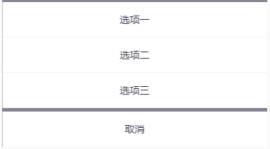

# tg-action-sheet 动作面板

##基础用法



```html
<tg-action-sheet
	v-model="visible" :data="data" @select="handleSelect" @cancel="handleCancel"
></tg-action-sheet>
```
```js
data() {
	return {
		visible: false,
		data: [
			{ content: '选项一' },
			{ content: '选项二' },
			{ content: '选项三' }
		],
	}
},
methods: {
	handleSelect(item, index){
		console.log('select', item, index) //item为选中项对象，index为选中项索引值
	},
	handleCancel(){
		console.log('cancel')
	},
}
```

##基础功能用法

###`maskClosable`属性控制蒙层点击后是否触发关闭

```html
<tg-action-sheet
	v-model="visible" :data="data" @select="handleSelect" @cancel="handleCancel" :maskClosable="false"
></tg-action-sheet>
```
###`active`属性高亮某一项


```html
<tg-action-sheet
	v-model="visible" :data="data" @select="handleSelect" @cancel="handleCancel" :active="0"
></tg-action-sheet>
```
### 完整的data数据模型


```js
data() {
	return {
		data: [
			{ content: '选项一', align: 'left', class: 'demo-class1' },
			{ content: '选项二', align: 'center', class: 'demo-class2' },
			{ content: '选项三', align: 'right', class: 'demo-class3' }
		],
	}
}
```

##API

### 属性(Attributes)

| 参数 | 功能说明 | 类型 | 可选值 | 默认值 | 备注 |
|------|-------|---------|-------|--------|--------|
| v-model | 显示/隐藏 | Boolean | false/true | `false` | 默认关闭 |
| maskClosable | 点击遮罩是否触发关闭遮罩 | Boolean | true/false | `true` | 默认点击触发 |
| active | 高亮项 | Number | - | `-1` |  |
| cancelTxt | 取消按钮文本 | String | - | `取消` |   |
| data | actionSheet模型数据 | Array | - | `[]` | - |

### 事件(Events)
| 事件名称 | 功能说明 | 回调参数1 | 回调参数2 |
|---------- |-------- |---------- |
| select  | 选中项触发事件 | 选中项对应的对象`item` | 选中项对应对象的索引值`index` |
| cancel  | 取消按钮触发事件 | - | - |
| mask-click  | 遮罩层触发事件 | - | - |