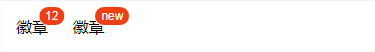
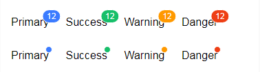

# tg-badge

## 基础用法

```html
<tg-badge value="12">徽章</tg-badge>
<tg-badge value="new">徽章</tg-badge>
```

##基本功能用法
### 最大值 (max)


>最大值（max）属性要求 value 必须是 Number 类型，超出设定值将显示 {max}+

```html
<tg-badge :value="12" :max="10">徽章</tg-badge>
```
### 圆点 (is-dot)


```html
<tg-badge is-dot>徽章</tg-badge>
```

### 颜色 (type)


>颜色有 `primary/success/warning/danger` 四种类型，其中 `danger` 为默认类型

```html
<tg-badge value="12" type="primary">Primary</tg-badge>
<tg-badge value="12" type="success">Success</tg-badge>
<tg-badge value="12" type="warning">Warning</tg-badge>
<tg-badge value="12" type="danger">Danger</tg-badge>
```

##API

### 属性(Attributes)

| 参数 | 功能说明 | 类型 | 可选值 | 默认值 | 备注 |
|------|-------|---------|-------|--------|--------|
| value | 显示值 | [String,Number] | - | - | - |
| max | 最大值，超过最大值会显示 '{max}+' | Number | - | - | 要求 value 是 Number 类型 |
| is-dot | 小圆点 | Boolean | - | false | - |
| type | 类型 | String | primary/success/warning/danger | `danger` | - |