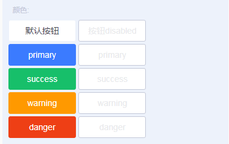

# tg-button 按钮

##标准用法


```html
<tg-button @click="handleClick">默认按钮</tg-button>
```

##基本功能用法

###按钮大小设定（size）


```html
<tg-button size="small>小按钮</tg-button>
<tg-button size="normal">普通按钮</tg-button>
<tg-button size="large">大按钮</tg-button>
```
###按钮颜色设定（type）



>目前颜色有 "default"(默认) 、"primary" 、 "success" 、 "warning" 、 "danger" 五种类型

```html
<tg-button type="default">普通按钮</tg-button>
<tg-button type="primary">primary</tg-button>
<tg-button type="success">success</tg-button>
<tg-button type="warning">warning</tg-button>
<tg-button type="danger">danger</tg-button>
```
### 按钮边框设定（plain）


```html
<tg-button plain>普通按钮</tg-button>
<tg-button type="primary" plain>普通按钮</tg-button>
<tg-button type="success" plain>普通按钮</tg-button>
<tg-button type="warning" plain>普通按钮</tg-button>
<tg-button type="danger" plain>普通按钮</tg-button>
```
### 按钮边框倒角设定（square）


```html
<tg-button square>无圆角按钮</tg-button>
<tg-button square type="primary">无圆角按钮</tg-button>
```
### 按钮块设定（block）


```html
<tg-button block>标准按钮</tg-button>
<tg-button size="small" block>小按钮</tg-button>
```
### 按钮原生类型设定（native-type）


```html
<tg-button native-type="button" type="primary">button类型</tg-button>
<tg-button native-type="submit" type="primary">submit类型</tg-button>
<tg-button native-type="reset" type="primary">reset类型</tg-button>
```
### 自定义按钮标签元素（tag）


```html
<tg-button tag="div" size="large">div标签</tg-button>
<tg-button tag="a" href="https://res.wisedu.com" target="_blank" size="large">a标签</tg-button>
```
### 按钮内容自定义


```html
<tg-button tag="div" size="large">
	<svg class="icon" aria-hidden="true">
		<use xlink:href="#plus"></use>
	</svg>
	<span>按钮</span>
</tg-button>
```
### 按钮组


```html
<tg-button-group>
	<tg-button size="large">按钮1</tg-button>
	<tg-button size="large" type="primary">按钮2</tg-button>
</tg-button-group>
<tg-button-group>
	<tg-button size="large">按钮1</tg-button>
	<tg-button size="large">按钮2</tg-button>
	<tg-button size="large" type="primary">按钮3</tg-button>
</tg-button-group>
<tg-button-group>
	<tg-input v-model="value"placeholder="请输入"/>
	<tg-button size="large" type="primary">按钮3</tg-button>
</tg-button-group>
```
>以上按钮组采用了`flex`布局,按钮组内的`tg-button`默认`flex:1`,其他自定义标签的布局方式需要自己添加样式类控制


##API

### 属性(Attributes)

| 参数 | 功能说明 | 类型 | 可选值 | 默认值 | 备注 |
|------|-------|---------|-------|--------|--------|
| size | 按钮尺寸 | String | small/normal/large | `normal` | - |
| type | 按钮类型 | String | default/primary | `default` | - |
| plain | 朴素按钮 | Boolean | true/false | `false` | - |
| square | 按钮边框有无圆角 | Boolean | true/false | `false` | 默认有圆角 |
| block | 按钮是否为块元素 | Boolean | true/false | `false` | - |
| native-type | 按钮原生type类型 | String | button/submit/reset | - | - |
| tag | 按钮标签元素自定义 | String | 元素标签 | - | 暂仅推荐使用`div`,`a`标签，其他未测试 |
| disabled | 按钮不可用 | Boolean | true/false | `false` | - |


### 事件(Events)
| 事件名称 | 说明 | 回调参数1 | 回调参数2 |
|---------- |-------- |---------- |
| click | 点击按钮且按钮状态不为禁用时触发 | - | - |

