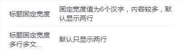

# tg-cell 表单模块组件


## 标准用法

>这里有三个基础属性: `title` 属性为标题参数，`value`属性为内容参数，	`name`属性为该组件的标识，默认会自动产生一个不重复的参数（形如： 'field-item-xxx'）,可用作唯一id
```html
<tg-cell name="tg-cell" title="标题" value="这是标准用法的内容"></tg-cell>
```
##基本功能用法

###只读/禁用（readonly/disabled）


```html
<tg-cell 
	title="标题"
	readonly
	value="readonly场景下的内容">
</tg-cell>
<tg-cell
	title="标题"
	readonly
	value="readonly场景下的内容">
</tg-cell>
```

###副标题（brief）

>副标题不宜过长，否则将会挤压右侧内容的宽度，可用 `solid` 加以控制

```html
<tg-cell 
	title="标题"
	brief="副标题不宜过长"
	value="readonly场景下的内容">
</tg-cell>
```
###必填（required）

>必填 <span style="color:red;">\*</span> 有两种实现形式，内置了 required 属性已实现，介于某些特定场景，样式无法满足时，可通过 `slot="left"` 进行自定义

```html
<tg-cell
	title="标题"
	required>
</tg-cell>
<tg-cell
	title="标题"
	value="自定义必填样式实例,自定义必填样式实例,自定义必填样式实例,自定义必填样式实例">
	<span slot="left" class="icon-required"></span>
</tg-cell>
```
```css
.icon-required:after{
	position: absolute;
	top: 26px;
	left: -10px;
	transform: translateY(-50%);
	z-index: 10;
	content: "*";
	font-family: SimSun;
	font-size: 14px;
	color: #EE3F15;
}
```
###标题固定宽度（solid）

>标题固定宽度，单行最大显示 6 个中文汉字，最多显示两行

```html
<tg-cell
	title="标题固定宽度"
	solid
	value="固定宽度值为6个汉字，内容较多，默认显示两行">
</tg-cell>
<tg-cell
	title="标题固定宽度多行多文字显示"
	solid
	value="默认只显示两行">
</tg-cell>
```
###标题/内容上对齐（baseline）

>使用场景： 当内容高度远大于标题是，推荐使用标题上对齐

```html
<tg-cell
	title="标题上对齐"
	solid
	baseline
	value="这是一句很长很长的描述性文字，长到可以超出两行，这是一句很长很长的描述性文字，长到可以超出两行">
</tg-cell>
```
###	箭头名称（arrow）

>箭头名称有 `上/下/左/右` 四种，分别对应 `arrow-up/arrow-down/arrow-left/arrow-right`

```html
<tg-cell
	title="标题"
	arrow="arrow-right"
	value="内置arrow可选[arrow-right/arrow-left/arrow-up/arrow-down]">
</tg-cell>
```
###	内容对齐方式（align）


```html
<tg-cell
	title="标题"
	value="内容默认左对齐">
</tg-cell>
<tg-cell
	align="center"
	title="标题"
	value="内容居中">
</tg-cell>
<tg-cell
	title="标题"
	align="right"
	value="内容右对齐">
</tg-cell>
```

##	高阶组合用法
### 插槽用法（slot）

>插槽有 `left` 、`right`、默认内容（slot）三个，其中默认内容插槽使用需要在 `tg-cell` 标签上添加 `customized` 属性

```html
<tg-cell
	title="标题"
	value="左侧标题图标插槽">
	<svg class="icon" aria-hidden="true" slot="left" >
		<use xlink:href="#arrow"></use>
	</svg>
</tg-cell>
<tg-cell
	title="标题"
	baseline
	customized>
	<div>内容自定义插槽</div>
</tg-cell>
<tg-cell
	title="标题"
	value="右侧内容图标插槽">
	<svg class="icon" aria-hidden="true" slot="right" >
		<use xlink:href="#plus"></use>
	</svg>
</tg-cell>
```
### 与tg-cell-group组合使用

>**说明：** 	`tg-cell` 组件本身无边框样式，与 `tg-cell-group` 组合使用，那么非最后一个 `tg-cell` 会自动添加有一条下划线。 `tg-cell-group` 的 `title` 提供分组名称

```html
<tg-cell-group title="带大标题">
	<div class="tg-cell-bgtitle">大标题</div>
	<tg-cell
		title="标题"
		value="内容默认左对齐">
	</tg-cell>
	<tg-cell
		align="center"
		title="标题"
		value="内容居中">
	</tg-cell>
	<tg-cell
		title="标题"
		align="right"
		value="内容右对齐">
	</tg-cell>
</tg-cell-group>
```
```css
.tg-cell-bgtitle {
	height: 50px;
	line-height: 50px;
	font-size: 14px;
	color: #13152D;
	padding-left: 17px;
}
```

##API

### 属性(Attributes)

| 参数 | 功能说明 | 类型 | 可选值 | 默认值 | 备注 |
|------|-------|---------|-------|--------|--------|
| name | 标识 | [Number,String] | - | - | - |
| title | 标题 | String | - | - | - |
| value | 内容 | String | - | - | - |
| brief | 子标题 | String | - | - | - |
| readonly | 只读 | Boolean | true/false | `false` | - |
| disabled | 禁用 | Boolean | true/false | `false` | - |
| required | 必填 | Boolean | true/false | `false` | - |
| customized | 开启内容插槽自定义 | Boolean | true/false | `false` | - |
| solid | 固定标题宽度 | Boolean | true/false | `false` | 对副标题同样有效 |
| baseline | 标题/内容垂直方向上（基线）对齐 | Boolean | true/false | `false` | 该对齐方式针对整个cell容器 |
| arrow | 内置箭头图标 | String | arrow-up/arrow-down/arrow-left/arrow-right | - | - |
| align | 内容对齐方式 | String | center/left/right | `left` | - |
| column | 设定cell容器flex垂直布局 | Boolean | true/false | `false` | 仅用于 `tg-textarea` 布局，具体效果参看 `tg-textarea` 组件|


### 插槽(slot)
| 插槽名称 | 说明 |
|---------- |-------- |
| - | 自定义显示内容,使用时，`tg-cell` 需要设定 `customized`属性 |
| left | 自定义标题左侧内容（如：图标） |
| right | 自定义显示内容右侧内容（如：图标) |


### 事件(Events)
| 事件名称 | 说明 | 回调参数1 | 回调参数2 |
|---------- |-------- |---------- |
| click | 点击按钮且按钮状态不为只读或禁用时触发 | 当前点击 `tg-cell` 的name值 | - |


##tg-cell-group容器API
| 参数 | 功能说明 | 类型 | 可选值 | 默认值 | 备注 |
|------|-------|---------|-------|--------|--------|
| title | cell组标题 | String | - | - | - |