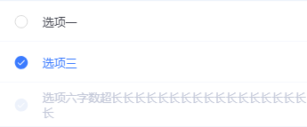
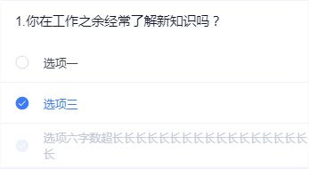
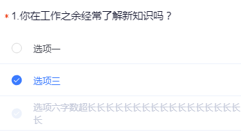
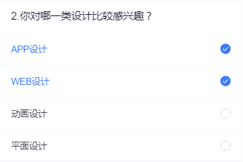
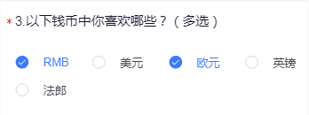
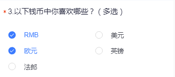

# tg-checkbox-group 复选框组

##基础用法


>options数据， `label` 属性为显示文本， `value` 属性为标识值（可以是其id值），`disabled` 属性控制是否禁用

```html
<tg-check-group
	v-model="selected"
	:options="options">
</tg-check-group>
```
```js
data() {
	return {
		selected: ["2","3"],
		options: [
			{value: '1', label: '选项一', disabled: false},
			{value: '2', label: '选项三', disabled: false},
			{value: '3', label: '选项六字数超长长长长长长长长长长长长长长长长长长', disabled: true}
		]
	}
}
```
##基础功能用法

###复选框组标题（title）

```html
<tg-check-group
	v-model="selected"
	title="1.你在工作之余经常了解新知识吗？"
	:options="options">
</tg-check-group>
```

###复选框组标题+必选（required）

```html
<tg-check-group
	v-model="selected"
	title="1.你在工作之余经常了解新知识吗？"
	required
	:options="options">
</tg-check-group>
```

###复选框组图标位置（iconPosition）

```html
<tg-check-group
	v-model="selected"
	title="2.你对哪一类设计比较感兴趣？"
	iconPosition="right"
	:options="options">
</tg-check-group>
```

###复选框组可选最多项设置（max）

>**当设置 `:max="1"` 时，即复选框组单选，请自行区别与 `radio` 单选区分，且此时v-model为String类型**

```html
<tg-check-group
	v-model="selected"
	:max="3"
	:options="options">
</tg-check-group>
```

###复选框组禁用（disabled）

```html
<tg-check-group
	v-model="selected"
	disabled
	:options="options">
</tg-check-group>
```
###复选框组横线布局（horizontal）


```html
<tg-check-group
	v-model="selected"
	required
	title="3.以下钱币中你喜欢哪些？（多选）"
	:options="options"
	horizontal>
</tg-check-group>
```
###复选框组横线布局每行列数（column）


```html
<tg-check-group
	v-model="selected"
	required
	title="3.以下钱币中你喜欢哪些？（多选）"
	:options="options"
	horizontal
	:column="2">
</tg-check-group>
```


##API

### 属性(Attributes)

| 参数 | 功能说明 | 类型 | 可选值 | 默认值 | 备注 |
|------|-------|---------|-------|--------|--------|
| v-model | 复选框组选中值 | [Array,String] | - | - | 若为单选则用String, 若为多选则是Array |
| options | 复选框组源数据 | Array | - | - | - |
| title | 复选框标题 | String | - | - | - |
| required | 必填* | Boolean | true/false | `false` | 仅在有标题（title）时有效 |
| iconPosition | 选项图标位置 | String | left/right | `left` | - |
| max | 最多选择几项 | Number | - | `0` | 为1为单选,为0不限制数量,大于1则是限制至多选择数量 |
| disabled | 是否禁用 | Boolean | true/false | `false` | - |
| horizontal | 复选框组横线布局 | Boolean | true/false | `false` | - |
| column | 横向布局一行内显示的几项 | Number | 2/4 | `4` | 仅在 `horizontal` 为 `true` 时有效，默认一行显示4列，即各项占宽（25%） |

### options属性 子属性说明
选择项数组格式如下，其中value值必填, 其余为选填。

```js
[
  { value: '值', lable:'标题',disabled: false }
]
```

### 事件(Events)

| 事件名称 | 功能说明 | 回调参数1 | 回调参数2 |
|---------- |-------- |---------- |
| change | v-model值改变时触发 | 当前v-model的值 | - |