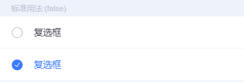
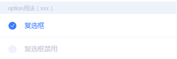
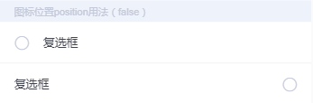

# tg-checkbox 复选框

##基础用法



```html
<tg-checkbox v-model="checked">复选框</tg-checkbox>
```
##基础功能用法

###数据为Object格式，且运行设定为disabled

>Object数据格式下， `label` 属性为显示文本， `value` 属性为标识值，可以是其id值，`disabled` 属性控制是否禁用
```html
<tg-checkbox 
	v-model="checked"
	:option="option">
</tg-checkbox>
<tg-checkbox 
	v-model="checked"
	:option="option1">
</tg-checkbox>
```
```js
data() {
	return {
		checked: 'xxx',
		option: {
			label: "复选框",
			value: "xxx",
			disabled: false
		},
		option1: {
			label: "复选框禁用",
			value: "xxx",
			disabled: true
		}
	}
},
```
###图标位置（position）

```html
<tg-checkbox 
	v-model="checked"
	position="left">
复选框</tg-checkbox>
<tg-checkbox 
	v-model="checked"
	position="right">
复选框</tg-checkbox>
```

##API

### 属性(Attributes)

| 参数 | 功能说明 | 类型 | 可选值 | 默认值 | 备注 |
|------|-------|---------|-------|--------|--------|
| v-model | 当前值 | Boolean/String | - | - | - |
| position | 图标显示的位置 | String | left/right | `left` | - |
| option | checkbox数据模型 | Object | - | - | 包含 label/value/disabled 三个属性 |

### option属性 子属性说明
选择项数组格式如下，其中value值必填, 其余为选填。

```js
[
  { value: '值', lable:'标题',disabled: false }
]
```

### 事件(Events)

| 事件名称 | 功能说明 | 回调参数1 | 回调参数2 |
|---------- |-------- |---------- |
| change | v-model值改变时触发 | 当前v-model的值 | - |