# tg-input

## 基础用法


```html
<tg-input v-model="value"></tg-input>
```

##基本功能用法
### 显示清除图标（clearable）


```html
<tg-input v-model="value" clearable></tg-input>
```


### 是否隐藏密码（eye）
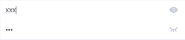
> `eye` 属性仅限于 `type="password"` 时有效，默认可见模式图标，点击可切换为不可见模式图标及密码值。eye也可以是对象，如：{open: true}, `open` 用来设置默认是可见/非可见图标

```html
<tg-input v-model="value" type="password" eye></tg-input>
```

### 自动聚焦（autofocus）


```html
<tg-input v-model="value" autofocus></tg-input>
```

### 原生type的四种类型
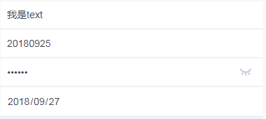

```html
<tg-input v-model="value_text" type="textarea" class="border-buttom"></tg-input>
<tg-input v-model="value_number" type="number" class="border-buttom"></tg-input>
<tg-input v-model="value_password" type="password" :eye="eye" class="border-buttom"></tg-input>
<tg-input v-model="value_date" type="date" class="border-buttom"></tg-input>
```
```js
data() {
	return {
		value_text:'我是text',
		value_number: '20180925',
		value_password: '111111',
		value_date: '2018-09-27',
		eye: {open: false}
	}
}
```

### 只读（readonly）、禁用（disabled）两种状态


```html
<tg-input v-model="value" readonly type="text" placeholder="只读状态" class="border-buttom"></tg-input>
<tg-input v-model="value" disabled type="text" placeholder="禁用状态" class="border-buttom"></tg-input>
```

###最多输入字符数（maxlength）

>示例最大输入值为 `9` ，如图所示。组件默认值为 `60` 个字符数

```html
<tg-input v-model="value" :maxlength="9" type="text" placeholder="maxlength=9"></tg-input>
```


##高级组合用法
### 标准表单输入类组件（input与cell组合）
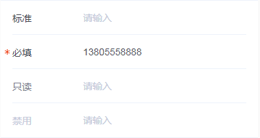

```html
<tg-cell-group title="表单标准模式">
	<tg-cell title="标准" customized solid>
		<tg-input 
			v-model="value0"
			placeholder="请输入"
			type="text">
		</tg-input>
	</tg-cell>
	<tg-cell title="必填" customized solid required>
		<tg-input 
			v-model="value1"
			placeholder="请输入"
			type="text">
		</tg-input>
	</tg-cell>
	<tg-cell title="只读" customized solid readonly>
		<tg-input 
			v-model="value"
			readonly
			placeholder="请输入"
			type="text">
		</tg-input>
	</tg-cell>
	<tg-cell title="禁用" customized solid disabled>
		<tg-input 
			v-model="value"
			disabled
			placeholder="请输入"
			type="text">
		</tg-input>
	</tg-cell>
</tg-cell-group>
```
###标题与输入值关联模式（column）


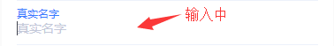

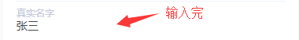

```html
<tg-cell customized>
	<tg-input 
		v-model="value"
		placeholder="真实名字"
		column
		type="text">
	</tg-input>
</tg-cell>
```

###必填项校验（validateFail）
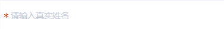
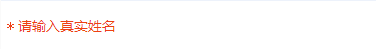
>示例仅展示如何使用 `validateFail` 属性修改样式，具体何时配合业务逻辑使用，需要开发者考虑。

```html
<tg-cell customized required>
	<tg-input 
		v-model="value"
		placeholder="请输入真实姓名"
		:validateFail="validateFail"
		type="text">
	</tg-input>
</tg-cell>
<button @click="validateHandle">校验</button>
```
```js
data() {
	return {
		value:'',
		validateFail: false
	}
},
methods: {
	validateHandle(){
		this.validateFail = !this.validateFail;
	}
},
```

###输入值自定义校验（validate/validateInfo）
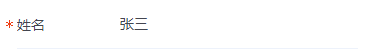

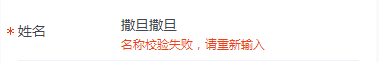
>这里可以通过 `blur/change` 事件，也可以通过监听 `value` 值来进行校验

```html
<tg-cell title="姓名" customized solid required>
	<tg-input 
		v-model="value"
		placeholder="请输入"
		validate
		:validateInfo="validateInfo"
		@blur="validateHandle">
	</tg-input>
</tg-cell>
```
```js
data() {
	return {
		value:'',
		validateInfo: ''
	}
},
methods: {
	validateHandle(val){
		//校验输入值是否为空；是否为指定值
		if(!val){
			this.validateInfo = '输入名称不能为空'
		}else{
			this.validateInfo = val!=='张三'?'名称校验失败，请重新输入':'';
		}
	}
},
```

###标题与输入值关联模式 输入值校验（column/validateInfo）
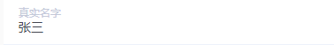

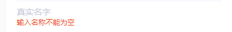

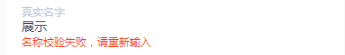

```html
<tg-cell customized>
	<tg-input 
		v-model="value"
		placeholder="真实名字"
		column
		:validateInfo="validateInfo"
		@blur="handleBlur">
	</tg-input>
</tg-cell>
```
```js
data() {
	return {
		value:'',
		validateInfo: ''
	}
},
methods: {
	handleBlur(val){
		//校验输入值是否为空；是否为指定值
		if(!val){
			this.validateInfo = '输入名称不能为空'
		}else{
			this.validateInfo = val!=='张三'?'名称校验失败，请重新输入':'';
		}
	}
},
```
###特殊场景下携带单位/符号用法
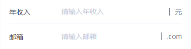

```html
<tg-cell title="年收入" solid customized>
	<tg-input 
		v-model="value"
		placeholder="请输入年收入"
		type="number">
	</tg-input>
	<div slot="right" class="tg-cell-suffix"><span>元</span></div>
</tg-cell>
<tg-cell title="邮箱" solid customized>
	<tg-input 
		v-model="value"
		placeholder="请输入邮箱"
		type="text">
	</tg-input>
	<div slot="right" class="tg-cell-suffix"><span>.com</span></div>
</tg-cell>
```
```css
.tg-cell-suffix{
	font-size: 14px;
	color: #767A8C;
	text-align: right;
	margin-left: 4px;
}
.tg-cell-suffix:before{
	content: "";
	display: inline-block;
	margin-bottom: -2px;
	width: 1px;
	height: 15px;
	background: #767A8C;
}
.tg-cell-suffix span{
	margin-left: 10px;
}
```


##API

### 属性(Attributes)

| 参数 | 功能说明 | 类型 | 可选值 | 默认值 | 备注 |
|------|-------|---------|-------|--------|--------|
| v-model | 输入值 | String | - | - | - |
| type | input类型 | String | text/number/password/date | `text` | - |
| readonly | 只读 | Boolean | true/false | `false` | - |
| disabled | 禁用 | Boolean | true/false | `false` | - |
| clearable | 是否显示清空图标 | Boolean | true/false | `false` | 默认不显示 |
| eye | 是否显示密码可视图标 | Boolean/Object | true/false/{open:false} | `false` | 仅在 `type=password` 有效，默认 `false` 隐藏图标，`true`显示图标；也可以设定 `{open:false}` 来设定默认显示图标  |
| maxlength | 允许输入的最大字符数 | Number | - | 60 | - |
| placeholder | input提示文档 | String | - | `请输入` | - |
| autofocus | 自动聚焦 | Boolean | true/false | `false` | - |
| validateFail | 输入是否为空校验 | Boolean | true/false | `false` | - |
| validate | 是否启用校验 | Boolean | true/false | `false` | - |
| validateInfo | 校验失败提示信息 | String | - | - | - |
| column | 是否启用标题与输入值交互的模式 | Boolean | true/false | `false` | - |


### 插槽(slot)
| 插槽名称 | 说明 |
|---------- |-------- |
| prepend | 自定义input左侧内容（如：图标） |
| append | 自定义input右侧内容（如：图标）|


### 事件(Events)
| 事件名称 | 说明 | 回调参数1 | 回调参数2 |
|---------- |-------- |---------- |
| focus | 输入框获取焦点时触发 | 当前 `v-model` 值 | - |
| blur | 输入框失去焦点时触发 | 当前 `v-model` 值 | - |
| change | 输入值发生改变时触发 | 当前 `v-model` 值 | - |