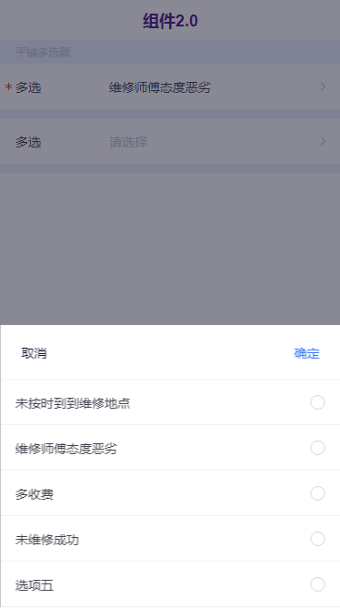
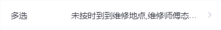
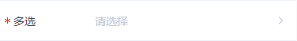
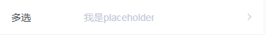
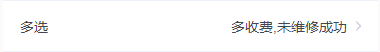
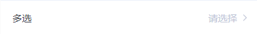
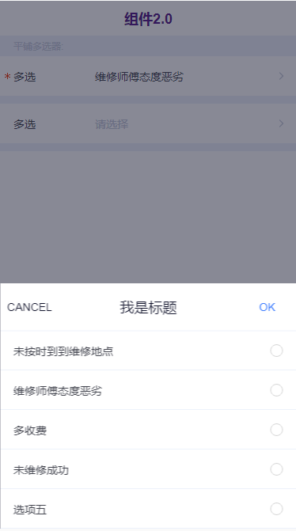
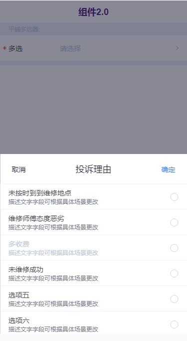
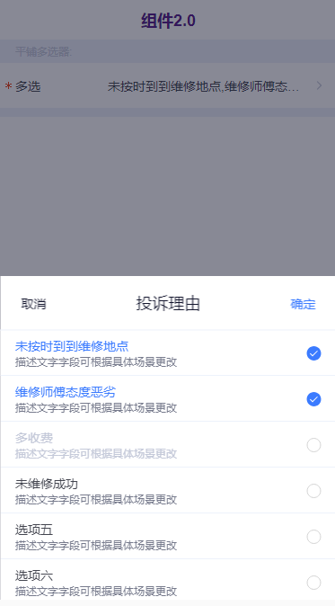

# tg-muti-picker

## 基础用法



> `v-model` 的 `value` 值为数组类型，`title` 为选择器标题，`options`为选择项数据数组 

```html
<tg-multi-picker
	v-model="value"
	title="多选"
	:options="options">
</tg-multi-picker>
```
```js
data() {
	return {
		value: [],
		options: [
			{value: 'aaa', label: '未按时到到维修地点'},
			{value: 'bbb', label: '维修师傅态度恶劣'},
			{value: 'ccc', label: '多收费'},
			{value: 'ddd', label: '未维修成功'},
			{value: 'eee', label: '选项五'}
		]
	}
}
```

##基本功能用法
### 必填 (required)


```html
<tg-multi-picker
	v-model="value"
	title="多选"
	required
	:options="options">
</tg-multi-picker>
```

### 占位符 (placeholder)


```html
<tg-multi-picker
	v-model="value"
	title="多选"
	placeholder="我是placeholder"
	:options="options">
</tg-multi-picker>
```

### 选中值对齐方式 (align)



```html
<tg-multi-picker
	v-model="value"
	title="多选"
	align="right"
	:options="options">
</tg-multi-picker>
```

### 选择标题栏设置 (title-bar/ok-text/cancel-text)

>`title-bar` 用来自定义标题栏标题文本； `ok-text` 用来自定义标题栏确定按钮文本，`cancel-text` 用来自定义标题栏取消按钮文本

```html
<tg-multi-picker
	v-model="value"
	title="多选"
	title-bar="我是标题"
	ok-text="OK"
	cancel-text="CANCEL"
	:options="options">
</tg-multi-picker>
```

### options数据格式说明示例


```html
<tg-multi-picker
	v-model="value"
	title="多选"
	required
	title-bar="投诉理由"
	:options="options">
</tg-multi-picker>
```

> options数据格式如下图所示，其中 `value` , `label` 为必填，`desc` , `disabled` 为选填。

```js
options: [
	{value: 'aaa', label: '未按时到到维修地点',desc:"描述文字字段可根据具体场景更改",disabled:false},
	{value: 'bbb', label: '维修师傅态度恶劣',desc:"描述文字字段可根据具体场景更改",disabled:false},
	{value: 'ccc', label: '多收费',desc:"描述文字字段可根据具体场景更改",disabled:true},
	{value: 'ddd', label: '未维修成功',desc:"描述文字字段可根据具体场景更改",disabled:false},
	{value: 'eee', label: '选项五',desc:"描述文字字段可根据具体场景更改",disabled:false},
	{value: 'fff', label: '选项六',desc:"描述文字字段可根据具体场景更改",disabled:false},
	{value: 'ggg', label: '选项七',desc:"描述文字字段可根据具体场景更改",disabled:false},
	{value: 'hhh', label: '选项八',desc:"描述文字字段可根据具体场景更改",disabled:false}
],
```

### 数据回显问题示例（即初始化 `value` 不为空数据）

>数组 `value` 值，包含的是选择项的 `value` 值（即常见数据的 `id` 值）。

```html
<tg-multi-picker
	v-model="value"
	title="多选"
	required
	title-bar="投诉理由"
	:options="options">
</tg-multi-picker>
```
```js
data() {
	return {
		value: ['aaa','bbb','mmm'],
		options: [
			{value: 'aaa', label: '未按时到到维修地点',desc:"描述文字字段可根据具体场景更改",disabled:false},
			{value: 'bbb', label: '维修师傅态度恶劣',desc:"描述文字字段可根据具体场景更改",disabled:false},
			{value: 'ccc', label: '多收费',desc:"描述文字字段可根据具体场景更改",disabled:true},
			{value: 'ddd', label: '未维修成功',desc:"描述文字字段可根据具体场景更改",disabled:false},
			{value: 'eee', label: '选项五',desc:"描述文字字段可根据具体场景更改",disabled:false},
			{value: 'fff', label: '选项六',desc:"描述文字字段可根据具体场景更改",disabled:false},
			{value: 'ggg', label: '选项七',desc:"描述文字字段可根据具体场景更改",disabled:false},
			{value: 'hhh', label: '选项八',desc:"描述文字字段可根据具体场景更改",disabled:false}
		],
	}
}
```

##API

### 属性(Attributes)

| 参数 | 功能说明 | 类型 | 可选值 | 默认值 | 备注 |
|------|-------|---------|-------|--------|--------|
| v-model | 选中值 | Array | - | - | - |
| title | 选择器标题 | String | - | - | - |
| options | 数据源 | Array | - | `[]` | - |
| title-bar | 选择项toolbar标题 | String | - | - | - |
| ok-text | 选择器确认文本 | String | - | `确认` | - |
| cancel-text | 选择器取消文本 | String | - | `取消` | - |
| align | 选中项对齐方式 | String | left/center/right | 'left' | - |
| placeholder | 提示文本占位符 | String | - | '请选择' | - |
| required | 必填 | Boolean | true/false | `false` | - |
| disabled | 禁用 | Boolean | true/false | `false` | - |
| mask-closable | 点击蒙层是否可关闭弹出层 | Boolean | true/false | `true` | - |


### 事件(Events)
| 事件名称 | 说明 | 回调参数1 | 回调参数2 |
|---------- |-------- |---------- |
| confirm | 点击确定按钮时触发 | 选中项数组，数组中为每一个选中项对象 | - |
| cancel | 点击取消按钮时触发 | - | - |