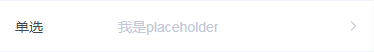

# tg-picker

## 基础用法


> value 为选中对象的 value (即唯一标识)值, options 数据格式为[[{text: 'xxx',value: 'xxx'}]]

```html
<tg-picker
    v-model="value"
    title="单选"
    :options="options"
    @confirm="handleConfirm">
</tg-picker>
```
```js
data() {
    return {
        value: [],
        options: [
            [{ text: '剧毒', value: '001' }, 
            { text: '蚂蚁', value: '002' },
            { text: '幽鬼', value: '003' },
            { text: '主宰', value: '004' },
            { text: '卡尔', value: '005' },
            { text: '宙斯', value: '006' },
            { text: '巫医', value: '007' }, 
            { text: '巫妖', value: '008'}]
        ]
    }
}
```
## 基础功能用法
### 必填 (required)


```html
<tg-picker
    v-model="value"
    title="单选"
    required
    :options="options">
</tg-picker>
```

### 占位符 (placeholder)


```html
<tg-picker
    v-model="value"
    title="单选"
    placeholder="我是placeholder"
    :options="options">
</tg-picker>
```

### 选中值对齐方式 (align)


```html
<tg-picker
    v-model="value"
    title="单选"
    align="right"
    :options="options">
</tg-picker>
```

### 禁用 (disabled)


```html
<tg-picker
    v-model="value"
    title="单选"
    disabled
    :options="options">
</tg-picker>
```
### 初始化值 (default-value)

> default-value使用场景： 当数据源来初始化为空（`[]`）,在onClick事件触发时异步获取。在事件未触发前，通过初始化数据 `v-model` 中给出的 `value` 值无法获取到对应的 `text` 时,可传入 `default-value` (即数据源中对应的 `text`)。 当数据源存在时，展示值以 `v-model` 值为准

```html
<tg-picker
    v-model="value"
    title="单选"
    :options="options"
    :default-value="defaultValue"
    @onClick="handleClick"
></tg-picker>
```
```js
data() {
    return {
        value: ['005'],
        options: [],
        defaultValue: ['卡尔'],
    }
},
methods: {
    handleClick(){
        // 异步请求数据，获取数据源，赋值给options
    }
},
```

### 多列多选 (cols)


```html
<tg-picker
    v-model="value"
    title="独立多选"
    :cols="2"
    :options="options">
</tg-picker>
```
```js
data() {
    return {
        value: ['005','103'],
        options: [
            [
                { text: '剧毒', value: '001' }, 
                { text: '蚂蚁', value: '002' },
                { text: '幽鬼', value: '003' },
                { text: '主宰', value: '004' },
                { text: '卡尔', value: '005' },
                { text: '宙斯', value: '006' },
                { text: '巫医', value: '007' }, 
                { text: '巫妖', value: '008'}
            ],
            [
                { text: '输出', value: '100' }, 
                { text: '控制', value: '101' },
                { text: '核心', value: '102' },
                { text: '爆发', value: '103' },
                { text: '辅助', value: '104' },
                { text: '打野', value: '105'}
            ]
        ]
    }
},
```
### 多列级联多选（is-cascade）

>[地区数据样例](http://res.wisedu.com/fe_components/mock/district.js)（示例引入： `import district from '../../static/mock/district.js'`）

```html
<tg-picker
    v-model="value"
    title="级联多选-地区"
    :cols="3"
    :options="options"
    is-cascade
    @confirm="handleConfirm"
    @onClick="handleClick('cascade')">
</tg-picker>
```
```js
data() {
    return {
        value: ["330000","331100","331122"],
        options: district
    }
}
```


 
## API

### 属性

| 参数 | 说明 | 类型 | 可选值 | 默认值 | 备注 |
|------|-------|---------|-------|--------|--------|
| v-model | 选中值 | Array | - | `[]` | - |
| options | 数据源 | Array | - | `[]` | - |
| title | 选择器标题 | String | - | - | - |
| required | 必填（*） | Boolean | false/true | `false` | - |
| disabled | 禁用 | Boolean | true/false | `false` | - |
| align | 选中项对齐方式 | String | left/center/right | `left` | - |
| placeholder | 提示文本占位符 | String | - | `请选择` | - |
| default-value | 初始化值显示文本 | String | - | - | 适用于 `options` 异步获取 |
| cols | 多选列数 | Number | - | `1` | **不建议多于3 列** |


### Events
| 事件名称 | 说明 | 回调参数1 | 回调参数2 |
|--------- |-------- |---------- |---------- |
| confirm  | 选择器组件点击"确定"是触发的事件 | 选中值文本 | 选中项对象 |
| onClick  | 选择器组件点中展开时触发，可用于异步传入数据源（options） | - | - |
