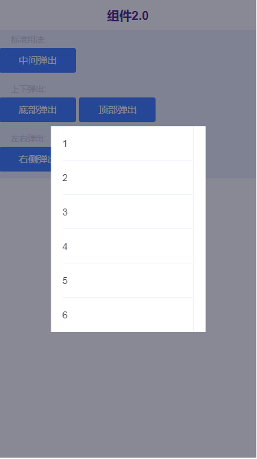
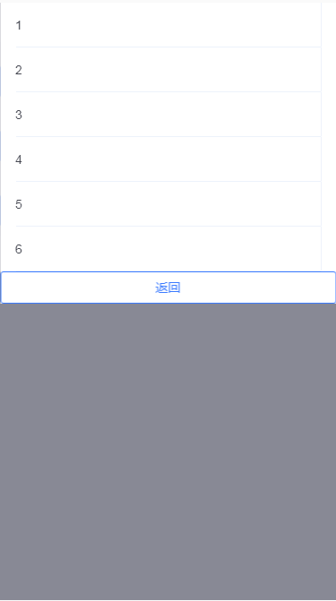
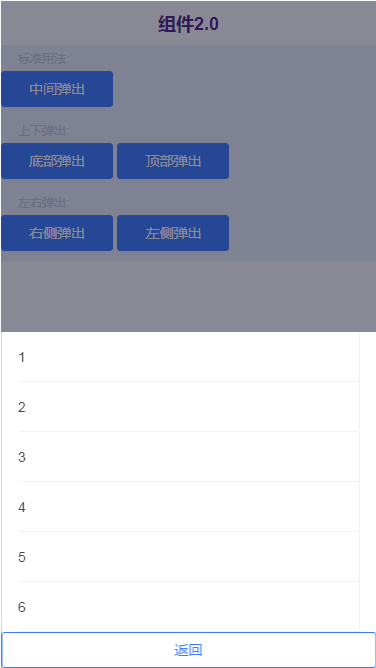
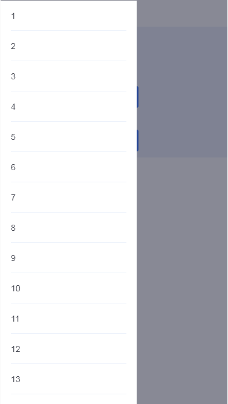

# tg-popup

## 基础用法

>默认中间弹出,对于蒙层上的内容为开发者自定义，宽、高自然是由内容撑出来，具体宽多少合适？高度多少该设置滚动？开发者需要自行考虑，如实例所示样式。

```html
<tg-button type="primary" @click="handleClick">中间弹出</tg-button>
<tg-popup v-model="visible">
	<tg-cell-group class="scroll">
		<tg-cell v-for="n in 10" :key="n" :value="String(n)"></tg-cell>
	</tg-cell-group>
</tg-popup>
```
```js
data() {
	return {
		visible: false
	}
},
methods: {
	handleClick(){
		this.visible = true;
	}
}
```
```css
.tg-popup .van-popup--center .scroll{
	height:300px;
	overflow-y: scroll;
	-webkit-overflow-scrolling:touch;
}
.tg-popup .van-popup--center {
	width: 60%;
}
```
## 基本功能用法
###弹出层弹出位置（position）




>position属性可选值有 `left/right/top/bottom/center` ,默认为 `center` 。左右时，内容内置高度为 `100%` ,宽度为 `60%`。

```html
<tg-button type="primary" @click="handleClick('bottom')">底部弹出</tg-button>
<tg-button type="primary" @click="handleClick('top')">顶部弹出</tg-button>
<tg-button type="primary" @click="handleClick('right')">右侧弹出</tg-button>
<tg-button type="primary" @click="handleClick('left')">左侧弹出</tg-button>

<tg-popup :position="position" v-model="visible">
	<tg-cell-group class="scroll">
		<tg-cell v-for="n in 20" :key="n" :value="String(n)"></tg-cell>
	</tg-cell-group>
	<tg-button block @click="visible=false" type="primary" plain>返回</tg-button>
</tg-popup>
```
```js
data() {
	return {
		visible: false
		position: ''
	}
},
methods: {
	handleClick(){
		this.position = value;
		this.visible = true;
	}
}
```


##API

### 属性(Attributes)

| 参数 | 功能说明 | 类型 | 可选值 | 默认值 | 备注 |
|------|-------|---------|-------|--------|--------|
| v-model | 当前组件是否显示 | Boolean | true/false | `false` | - |
| position | 蒙层弹出位置 | String | left/right/top/bottom/center | 'center' | - |
| hasMask | 是否有蒙层 | Boolean | true/false | `true` | - |
| maskClosable | 点击蒙层是否关闭 Popup | Boolean | true/false | `true` | - |
| lockScroll | 是否锁定背景滚动 | Boolean | true/false | `true` | - |


### 事件(Events)
| 事件名称 | 说明 | 回调参数1 | 回调参数2 |
|---------- |-------- |---------- |
| mask-click | 点击蒙层触发 | - | - |
