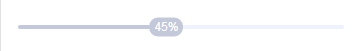
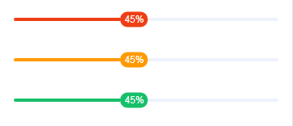
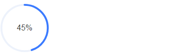
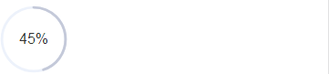
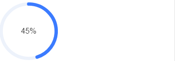
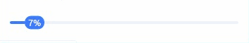

# tg-progress

## 基础用法


> 进度组件（tg-progress）主要分为 **条形**_(type="line")_ 与 **圆形**_(type="circle")_ 两种形态，默认为 **条形** 。其中 `v-model` 值为相对 100 的百分值，如实例 `value=45` (即 45%) ， `text` 为进度条文本。

```html
<tg-progress v-model="value" :text="text"></tg-progress>
<tg-progress v-model="value" type="circle" :text='text'></tg-progress>
```
```js
data() {
	return {
		value: 45,
		text: '45%'
	}
}
```

## 条形（line）进度条基础功能用法

### 是否显示进度文字（showText）

> 默认显示进度文字

```html
<tg-progress v-model="value" :text="text" :showText="false"></tg-progress>
```
```js
data() {
	return {
		value: 45,
		text: '45%'
	}
}
```
### 进度条置灰（inactive）


```html
<tg-progress v-model="value" :text="text" inactive></tg-progress>
```
### 进度条自定义颜色（color）


```html
<tg-progress v-model="value" :text="text" color="#EE3F15"></tg-progress>
<tg-progress v-model="value" :text="text" color="#FF9900"></tg-progress>
<tg-progress v-model="value" :text="text" color="#17BF6A"></tg-progress>
```

## 圆形（circle）进度条基础功能用法
### 进度条直径（size）


```html
<tg-progress v-model="value" :text="text" type="circle" size="100px"></tg-progress>
```
### 进度条置灰（inactive）


```html
<tg-progress v-model="value" :text="text"  type="circle" inactive></tg-progress>
```
### 进度条自定义颜色（color）


```html
<tg-progress v-model="value" :text="text" type="circle" color="#EE3F15"></tg-progress>
<tg-progress v-model="value" :text="text" type="circle" color="#FF9900"></tg-progress>
<tg-progress v-model="value" :text="text" type="circle" color="#17BF6A"></tg-progress>
```
### 进度条宽度（stroke-width）

> 此处设置的进度条宽度(_stroke-swidth_)最大值与 `size` 大小有关联

```html
<tg-progress v-model="value" :text="text" type="circle" size="120px" :stroke-width="60"></tg-progress>
```

## 进度条动态使用示例



```html
<tg-progress v-model="value" :text="text"></tg-progress>
<tg-progress v-model="value" type="circle" :text='text'></tg-progress>
<tg-button @click="start">开始</tg-button>	
```
```js
data() {
	return {
		value: 0
	}
},
computed: {
	text() {
		return this.value.toFixed(0) + '%'
	}
},
methods: {
	start(){
		var self = this;
		if(self.value ===100) self.value = 0; 
		var time = setInterval(function(){
			self.value++;
			if(self.value ===100){
				clearInterval(time)
			}
		},100)
	}
}
```
##API

### 属性(Attributes)

| 参数 | 功能说明 | 类型 | 可选值 | 默认值 | 备注 |
|------|-------|---------|-------|--------|--------|
| v-model | 当前进度 | Number | - | - | 相对值为 `100` |
| text | 进度条文字 | String | - | - | 动态显示可参看 _进度条动态使用示例_ |
| type | 进度条类型 | String | line/circle | `line` | 默认条形进度条 |
| showText | 是否显示进度条文本 | Boolean | true/false | `true` | 仅在 `line` 类型下有效 |
| inactive | 进度条置灰 | Boolean | true/false | `false` | - |
| color | 进度条颜色 | String | - | `#3B7BFF` | 在 `line` 类型下，支持渐变色（如：`color="linear-gradient(to right, #be99ff, #7232dd)"`） |
| size | 圆形进度条直径 | String | - | `74px` | 仅在 `circle` 类型下有效 |
| stroke-width | 圆形进度条宽度 | Number | - | `40` | 仅在 `circle` 类型下有效 |
| fill | 圆形进度条圆内填充色 | String | - | `white` | 仅在 `circle` 类型下有效 |
| stroke | 圆形进度条填充色 | String | - | `#EDF2FB` | 仅在 `circle` 类型下有效 |