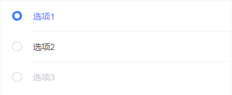
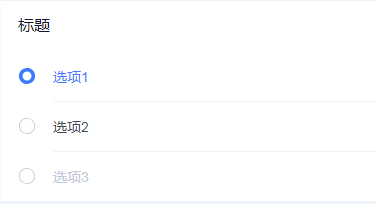
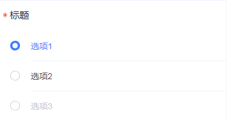
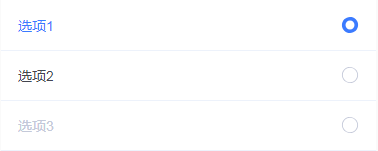
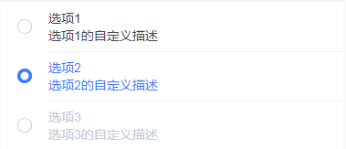
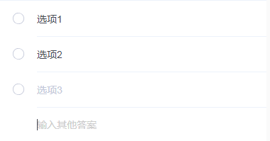
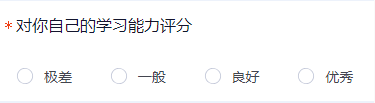
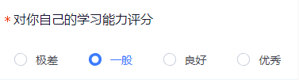
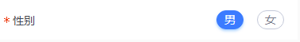

# tg-radio 单选框组

##基础用法


>options数据： `text` 属性为显示文本， `value` 属性为唯一标识值（可以是其id值），`disabled` 属性控制是否禁用

```html
<tg-radio v-model="value" :options="data"></tg-radio>
```
```js
data() {
	return {
		value: 'a',
		options: [
			{text: '选项1',value:'a'}, 
			{text: '选项2',value:'b'}, 
			{text: '选项3',value: 'c',disabled: true}
		]
	}
}
```

##基础功能用法

###标题（title）


```html
<tg-radio v-model="value" :options="data" title="标题"></tg-radio>
```
###必选（required）


>必选 * 仅在title存在时有效

```html
<tg-radio v-model="value" :options="data" title="标题" required></tg-radio>
```
###单选框的位置（icon-position）


>单选框图标默认居左，可设置为居右

```html
<tg-radio v-model="value" :options="data" icon-position="right"></tg-radio>
```

###text文本内容自定义（optionRender)


>`optionRender`为 `Function` 类型

```html
<tg-radio v-model="value" :options="data" :optionRender="optionRender"></tg-radio>
```
```js
data() {
	return {
		value: 'a',
		options: [
			{text: '选项1',value:'a'}, 
			{text: '选项2',value:'b'}, 
			{text: '选项3',value: 'c',disabled: true}
		]
	}
},
methods: {
	optionRender(item) {
		return `<div>${item.text}</div><div>${item.text}的自定义描述</div>`
	}
}
```
###补充选项（hasInputOption)


>inputOptionPlaceholder为配合使用属性,用作提示信息占位符

```html
<tg-radio v-model="value" :options="data" hasInputOption inputOptionPlaceholder="输入其他答案"></tg-radio>
```
###横向布局（horizontal）




> 该模式下，根据设计要求，选项一般 ≤ 4，且字数不宜过长，如果一行无法显示，请自行使用锤子布局形式，每项单独一行。

```html
<tg-radio v-model="value" :options="data" required title="对你自己的学习能力评分" horizontal @change="handleChange"></tg-radio>
```
```js
	data() {
		return {
			value: '',
			data: [
				{text: '极差'}, 
				{text: '一般'}, 
				{text: '良好'},
				{text: '优秀'}
			]
		}
	},
	methods: {
		handleChange(value,index){
			// value 为当前选中对象；index为选中对象在数组data中的索引值
		}
	},
```

##高级用法

###button模式（type="button"）


```html
<tg-cell name="tg-radio" title="性别" required solid align="right" customized>
	<tg-radio
		v-model="value"
		:options="data"
		type="button"
		horizontal>
	</tg-radio>
</tg-cell>
```
```js
	data() {
		return {
			value: '男',
			data: [
				{text: '男'}, 
				{text: '女'}
			]
		}
	}
```

##API

### 属性(Attributes)

| 参数 | 功能说明 | 类型 | 可选值 | 默认值 | 备注 |
|------|-------|---------|-------|--------|--------|
| value | 选中值 | {} | - | - | - |
| title | 标题 | String | - | - | - |
| required | 必填 | Boolean | true/false | `false` | - |
| icon-position | 单选框位置 | String | left/right | `left` | - |
| optionRender | 自定义渲染内容 | Function | - | - | 该方法可用来扩展options数据 |
| hasInputOption | 是否存在自定义输入项 | Boolean | true/false | `false` | - |
| inputOptionPlaceholder | 输入框提示信息占位符 | String | - | - | - |
| horizontal | 水平布局 | Boolean | true/false | `false` | - |
| type | 暂时用来控制是否为button选项 | String | button | `button` | 一般与 `tg-cell` 组件组合使用 |

### 事件(Events)
| 事件名称 | 说明 | 回调参数1 | 回调参数2 |
|---------- |-------- |---------- |
| change | 选择发生改变时触发 | 当前 `v-model` 值对应的对象 | 当前选中值对象在options中的索引值 |
