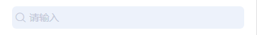
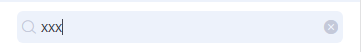
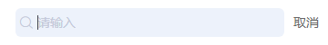
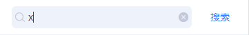

# tg-search

## 基础用法


```html
<tg-search 
	v-model="value"
	@focus="handleFocus"
	@blur="handleBlur"
	@change="handleChange">
</tg-search>
```

## 基础功能用法
### 显示内置【取消】按钮（show-action）


```html
<tg-search 
	v-model="value1"
	show-action
	@cancel="handleCancel">
</tg-search>
```
```js
methods: {
	handleCancel(){
		console.log('取消按钮被点击了！')
	}
}
```

### 自定义【取消】按钮（slot='actionBtn'）


```html
<tg-search 
	v-model="value2"
	show-action>
	<div slot="actionBtn" style="padding: 0 17px;color: #3B7BFF;" @click="handleClick">搜索</div>
</tg-search>
```
```js
methods: {
	handleClick(){
		console.log('按钮被点击了！')
	}
}
```

##API

### 属性(Attributes)

| 参数 | 功能说明 | 类型 | 可选值 | 默认值 | 备注 |
|------|-------|---------|-------|--------|--------|
| v-model | 输入值 | String | - | - | - |
| placeholder | 提示占位符 | String | - | `请输入` | - |
| show-action | 是否在搜索框右侧显示取消按钮 | Boolean | true/false | `false` | - |
| background | 	搜索框背景色 | String | - | `#FFFFFF` | - |


### 插槽(slot)
| 插槽名称 | 说明 |
|---------- |-------- |
| actionBtn | 取消按钮自定义插槽 |


### 事件(Events)
| 事件名称 | 说明 | 回调参数1 | 回调参数2 |
|---------- |-------- |---------- |
| focus | 获取焦点时触发 | 当前 `v-model` 值 | - |
| blur | 失去焦点时触发 | 当前 `v-model` 值 | - |
| change | 输入值改变时触发 | 当前 `v-model` 值 | - |
