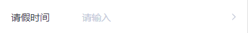
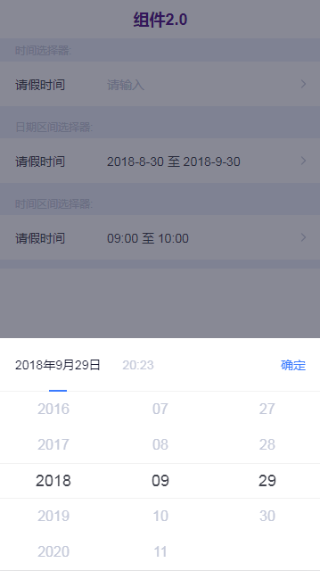
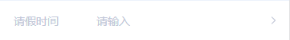
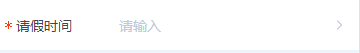
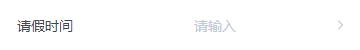
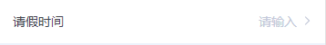
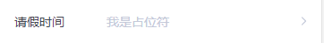
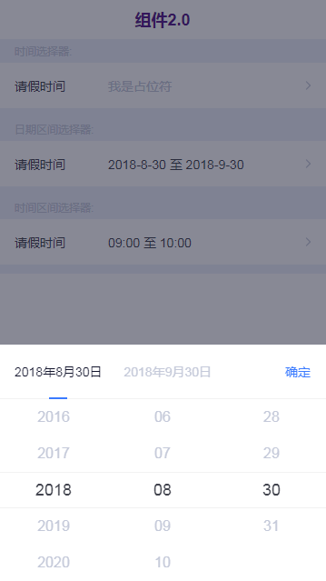
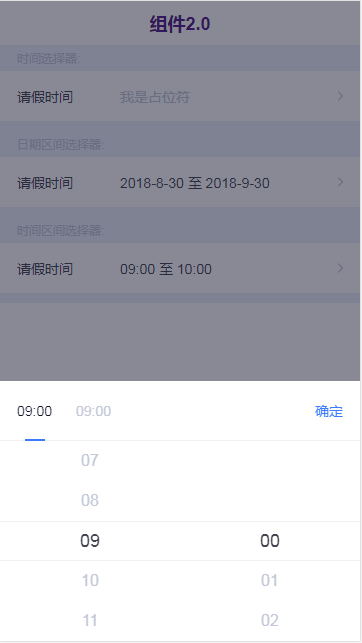

# tg-segment-picker 区间型选择器

## 基础用法




>默认 `type` 类型为 `datetime` (即日期时间选择) ，`value` 输出数据格式如： `2018-10-01 09:16`,如果想获取更详细数据，可通过 `@confirm` 参数获取。 

```html
<tg-segment-picker v-model="value" title="请假时间" @confirm="handleConfirm"></tg-segment-picker>
```
```js
data() {
	return {
		value: ''
	}
},
methods: {
	handleConfirm(param1,param2){
		// param1 数组类型，格式如["2018-9-30", "09:16"];
		// param2 数组类型，格式如[{currentDate: Sun Sep 30 2018 09:16:06 GMT+0800 (中国标准时间),type: "date"},{currentDate: "09:16",type: "time"}]
		console.log(param1,param2)
	}
},
```

##基础功能用法

### 禁用模式（disabled）


```html
<tg-segment-picker v-model="value" title="请假时间" disabled></tg-segment-picker>
```

### 必填模式（required）


```html
<tg-segment-picker v-model="value" title="请假时间" required></tg-segment-picker>
```

### 选中值对齐方式（align）






```html
<tg-segment-picker v-model="value" title="请假时间" align="right"></tg-segment-picker>
```
### 占位符文本（placeholder）


```html
<tg-segment-picker v-model="value" title="请假时间" placeholder="我是占位符"></tg-segment-picker>
```

### type类型（type）




> `type` 包含 `datetime/date/time` 三种类型，分别对应 _日期时间_ 选择器、 _日期区间_选择器、 _时间区间_选择器。没有给定值的情况下，默认为系统当前时间。

```html
<tg-segment-picker v-model="value" title="请假时间" type="datetime"></tg-segment-picker>
<tg-segment-picker v-model="value" title="请假时间" type="date"></tg-segment-picker>
<tg-segment-picker v-model="value" title="请假时间" type="time"></tg-segment-picker>
```

##API

### 属性(Attributes)

| 参数 | 功能说明 | 类型 | 可选值 | 默认值 | 备注 |
|------|-------|---------|-------|--------|--------|
| v-model | 选中值 | String | - | - | - |
| title | 选择器标题 | String | - | - | - |
| align | 选中项对齐方式 | String | left/center/right | 'left' | - |
| placeholder | 提示文本占位符 | String | - | '请选择' | - |
| required | 必填 | Boolean | true/false | `false` | - |
| disabled | 禁用 | Boolean | true/false | `false` | - |
| type | 区间选择器类型 | String | datetime/date/time | `datetime` | - |
| minDate | 日期下限 | Date | - | `new Date(currentYear - 99, 0, 1)` | - |
| maxDate | 日期上限 | Date | - | `new Date(currentYear + 30, 11, 31)` | - |
| minHour | 小时下限 | Number | - | `0` | - |
| maxHour | 小时上限 | Number | - | `24` | - |
| minMinute | 分钟下限 | Number | - | `0` | - |
| maxMinute | 分钟上限 | Number | - | `59` | - |


### 事件(Events)
| 事件名称 | 说明 | 回调参数1 | 回调参数2 |
|---------- |-------- |---------- |
| confirm | 点击确定按钮时触发 | 选中项值字符串数组 | 选中项值对象数组 |