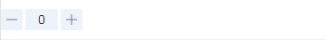
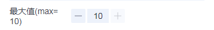
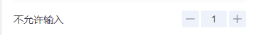
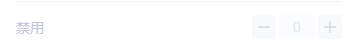
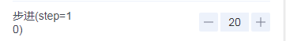
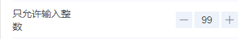

# tg-stepper 步进器组件

## 基础用法

> 由于第三方组件库的原因，但凡输入值较大，输入框无法完全显示时，请开发者自行添加样式控制内置 `input` 标签宽度。

```html
<tg-stepper v-model="value" @change="handleChange"></tg-stepper>
```
```js
data() {
	return {
		value: ''
	}
},
methods: {
	handleChange(val){
		console.log(val) 		// val为当前值
	}
},
```

## 与cell组件组合使用

### 设置输入值下限值(min)


```html
<tg-cell title="最小值(min=1)" solid customized>
	<tg-stepper v-model="value" min="1" @change="handleChange"></tg-stepper>
</tg-cell>
```

### 设置输入值上限值(max)


```html
<tg-cell title="最大值(max=10)" solid customized>
	<tg-stepper v-model="value" max="10" @change="handleChange"></tg-stepper>
</tg-cell>
```

### 输入框只读(readOnly)


```html
<tg-cell title="不允许输入" solid customized align="right">
	<tg-stepper v-model="value" readOnly @change="handleChange"></tg-stepper>
</tg-cell>
```

### 禁用(disabled)


```html
<tg-cell title="禁用" solid customized align="right">
	<tg-stepper v-model="value" disabled @change="handleChange"></tg-stepper>
</tg-cell>
```

### 步进数(step)


```html
<tg-cell title="步进(step=10)" solid customized align="right">
	<tg-stepper v-model="value" step="10" @change="handleChange"></tg-stepper>
</tg-cell>
```

### 整数输入(is-integer)


```html
<tg-cell title="整数输入" solid customized align="right">
	<tg-stepper v-model="value" is-integer @change="handleChange"></tg-stepper>
</tg-cell>
```

##API

### 属性(Attributes)

| 参数 | 功能说明 | 类型 | 可选值 | 默认值 | 备注 |
|------|-------|---------|-------|--------|--------|
| v-model | 步进值 | Number/String | - | - | - |
| min | 最小值 | Number/String | - | `-Infinity` | - |
| max | 最大值 | Number/String | -| 'Infinity' | - |
| readOnly | 输入框只读 | Boolean | true/false | `false` | - |
| disabled | 禁用 | Boolean | true/false | `false` | - |
| step | 每次改变步数，可以为小数 | Number/String | - | `1` | - |
| is-integer | 只能输入整数 | Boolean | true/false | `false` | - |


### 事件(Events)
| 事件名称 | 说明 | 回调参数1 | 回调参数2 |
|---------- |-------- |---------- |
| change | 步进发生改变时触发 | 当前步进器值 | - |