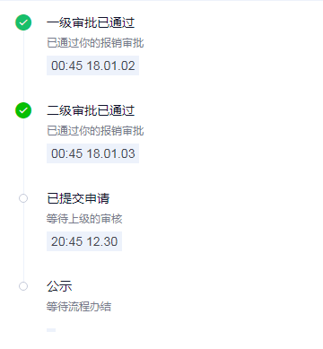
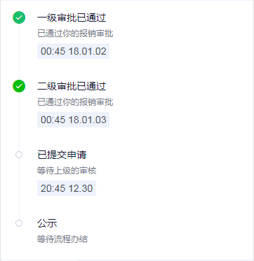

# tg-steps 流程（步骤条）组件

## 基础用法


> 流程组件主要有两种，一种是普通模式，另一只为卡片模式。用 `is-card` 属性区分。

```html
<tg-steps :active="active" :options="options"></tg-steps>
<tg-steps :active="active" :options="options" is-card></tg-steps>
```
```js
data() {
	return {
		active: 1,
		options: [
			{title: '一级审批已通过', desc: '已通过你的报销审批',time:'00:45 18.01.02'},
			{title: '二级审批已通过', desc: '已通过你的报销审批',time:'00:45 18.01.03'},
			{title: '已提交申请', desc: '等待上级的审核',time:'20:45 12.30'},
			{title: '公示', desc: '等待流程办结',time:''}
		]
	}
}
```

## 基础功能用法
### 步骤内容自定义（customized）



> 组件内内置了 `tg-step-title` , `tg-step-desc` , `tg-step-time` 等样式类，开发者可以直接使用

```html
<!-- 普通模式 -->
<tg-steps 
	:active="active"
	:options="options"
	customized>
	<div slot-scope="{ option }" >
		<div class="tg-step-title">{{option.title}}</div>
		<div class="tg-step-desc">{{option.desc}}</div>
		<div class="tg-step-default-time" v-if='option.time'>{{option.time}}</div>
	</div>
</tg-steps>
<!-- 卡片模式 -->
<tg-steps 
	:active="active"
	:options="options1"
	customized
	is-card>
	<div slot-scope="{ option }" >
		<div class="tg-step-title">{{option.title}}</div>
		<div class="tg-step-desc">
			<div>{{option.desc1}}</div>
			<div>{{option.desc2}}</div>
			<div>{{option.desc3}}</div>
		</div>
		<div class="tg-step-status">{{option.action}}</div>
	</div>
</tg-steps>
```
```js
data() {
	return {
		active: 1,
		options: [
			{title: '一级审批已通过', desc: '已通过你的报销审批',time:'00:45 18.01.02'},
			{title: '二级审批已通过', desc: '已通过你的报销审批',time:'00:45 18.01.03'},
			{title: '已提交申请', desc: '等待上级的审核',time:'20:45 12.30'},
			{title: '公示', desc: '等待流程办结',time:''}
		],
		options1: [
			{title: '拟稿人起草', desc1: `经办人：XXX`,desc2:'办理意见：这里是一行文本补充信息，只占位，无实际意义，最长就只显示两行文本',desc3:'耗时：1分24秒',action:'已退回',time:'2018.10.27 12:47'},
			{title: '拟稿人起草', desc1: `经办人：XXX`,desc2:'办理意见：这里是一行文本补充信息，只占位，无实际意义，最长就只显示两行文本',desc3:'耗时：1分24秒',action:'已提交',time:'2018.10.27 12:47'},
			{title: '拟稿人起草', desc1: `经办人：XXX`,desc2:'办理意见：这里是一行文本补充信息，只占位，无实际意义，最长就只显示两行文本',desc3:'耗时：1分24秒',action:'已通过',time:'2018.10.27 12:47'},
			{title: '拟稿人起草', desc1: `经办人：XXX`,desc2:'办理意见：这里是一行文本补充信息，只占位，无实际意义，最长就只显示两行文本',desc3:'耗时：1分24秒',action:'待办理',time:'2018.10.27 12:47'}
		]
	}
}
```

### options 数据格式说明

 `options` 为数组类型，当使用默认的步骤条模式，数据格式如下所示，`title` 必填，`desc` , `time` 选填；当步骤内容为自定义时，`options` 中子对象的属性值也可以根据业务需求自定义，需要注意的是，想要步骤中自带的时间显示方式，子对象的 **`time`** 属性依旧不可改变 

 ```js
 [
 	{title: '标题', desc: '解释文本',time:'Time'}
 ]
 ```

 ##API

### 属性(Attributes)

| 参数 | 功能说明 | 类型 | 可选值 | 默认值 | 备注 |
|------|-------|---------|-------|--------|--------|
| active | 步骤/流程的当前步骤 | Number | - | - | 第一条步骤标识为 **`0`** |
| options | 数据源 | Array | - | `[]` | - |
| customized | 是否自定义步骤内容 | Boolean | true/false | `false` | - |
| is-card | 是否选用卡片模式 | Boolean | true/false | `false` | - |


### 插槽(slot)
| 插槽名称 | 说明 |
|---------- |-------- |
| - | 步骤内容自定义插槽 |
