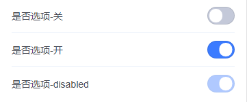

# tg-switch

## 基础用法

```html
<tg-switch v-model="value" @change="handleChange"></tg-switch>
```
```js
data() {
	return {
		value: true
	}
},
methods: {
	handleChange(val){
		console.log(val)
	}
}
```

## 与cell组件的组合用法

```html
<tg-cell-group>
	<tg-cell title="是否选项-关"  align="right" customized>
		<tg-switch 
			v-model="value1"
			@change="handleChange"
		></tg-switch>
	</tg-cell>
	<tg-cell title="是否选项-开"  align="right" customized>
		<tg-switch 
			v-model="value2"
			@change="handleChange"
		></tg-switch>
	</tg-cell>
	<tg-cell title="是否选项-disabled"  align="right" customized>
		<tg-switch 
			v-model="value2"
			disabled
			@change="handleChange"
		></tg-switch>
	</tg-cell>
</tg-cell-group>
```
```js
data() {
	return {
		value1: false,
		value2: true
	}
},
methods: {
	handleChange(val){
		console.log(val)
	}
}
```

##API

### 属性(Attributes)

| 参数 | 功能说明 | 类型 | 可选值 | 默认值 | 备注 |
|------|-------|---------|-------|--------|--------|
| v-model | 输入值 | Boolean | true/false | - | - |
| disabled | 是否禁用 | Boolean | true/false | `false` | - |
| size | 开关尺寸 | String | - | `24px` | - |


### 事件(Events)
| 事件名称 | 说明 | 回调参数1 | 回调参数2 |
|---------- |-------- |---------- |
| change | 开关改变时触发 | 当前 `v-model` 值 | - |