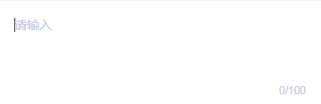
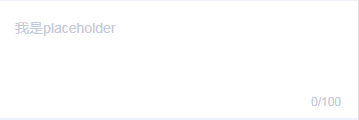
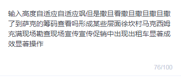
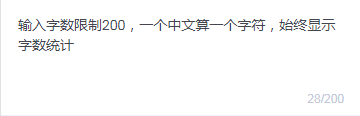
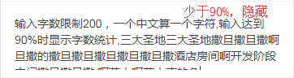
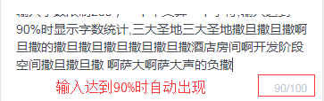

# tg-textarea

## 基础用法

```html
<tg-textarea v-model="value"></tg-textarea>
```
```js
data() {
	return {
		value: ''
	}
}
```

## 基础功能用法

### 提示占位符（placeholder）

```html
<tg-textarea v-model="value" placeholder="我是placeholder"></tg-textarea>
```

### textarea文本高度自适应（autosize）

```html
<tg-textarea v-model="value" autosize></tg-textarea>
```

### 最大输入字符数（maxlength）

```html
<tg-textarea v-model="value" :maxlength="200"></tg-textarea>
```

### 隐藏字数统计（indicator）




> `indicator` 属性用来隐藏字符统计（_0/100_）,这里的隐藏只是针对输入值小于允许输入最大值（_maxlength_）的 90% 而言，也就是说设置了 `indicator` 属性，键入的数据字符数 < `maxlength*90%` 时，字符统计是隐藏的，但当字符数达到临界值并超出时，字符统计还是会出现，起提示作用。

```html
<tg-textarea v-model="value" :indicator="false"></tg-textarea>
```