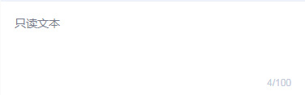

# tg-textarea

## 基础用法

```html
<tg-textarea v-model="value"></tg-textarea>
```
```js
data() {
	return {
		value: ''
	}
}
```

## 基础功能用法

### 提示占位符（placeholder）

```html
<tg-textarea v-model="value" placeholder="我是placeholder"></tg-textarea>
```
### 只读（readonly）


>字体颜色： #767A8C

```html
<tg-textarea v-model="value" readonly></tg-textarea>
```
### 禁用（disabled）


>字体颜色： #C4C9D9

```html
<tg-textarea v-model="value" disabled></tg-textarea>
```
### 必填（required）


```html
<tg-textarea v-model="value" required></tg-textarea>
<tg-textarea v-model="value" title="横向文本标题" placeholder="固定高度" isView required></tg-textarea>
<tg-textarea v-model="value" title="纵向文本标题" placeholder="固定高度" isView required direction='vertical'></tg-textarea>
```
### textarea文本高度自适应（autosize）

```html
<tg-textarea v-model="value" autosize></tg-textarea>
```

### 最大输入字符数（maxlength）

```html
<tg-textarea v-model="value" :maxlength="200"></tg-textarea>
```

### 隐藏字数统计（indicator）


> `indicator` 属性用来隐藏字符统计（_0/100_）,这里的隐藏只是针对输入值小于允许输入最大值（_maxlength_）的 90% 而言，也就是说设置了 `indicator` 属性，键入的数据字符数 < `maxlength*90%` 时，字符统计是隐藏的，但当字符数达到临界值并超出时，字符统计还是会出现，起提示作用。

```html
<tg-textarea v-model="value" :indicator="false"></tg-textarea>
```
## 高级用法

>textarea内置了与tg-cell组合后的大文本框，提供标题 `title` ,以及左右/上下结构的两种布局 `direction` (_horizontal/vertical_) 可选，默认横向布局（`horizontal`）。

###横向布局

```html
<tg-textarea v-model="value" title="横向文本标题" isView direction="horizontal"></tg-textarea>
```
###纵向布局

```html
<tg-textarea v-model="value" title="纵向文本标题" isView direction="vertical"></tg-textarea>
```
###与tg-cell-group组合
>tg-textarea组件边框线设置模式与tg-cell组件一致，未设置边框线，开发者可以根据自己的业务场景自行定义。当多表单使用时，可嵌套进tg-cell-group，提供内置的边框线。具体如实例图示：


```html
<tg-cell-group title="下上结构">
	<tg-textarea v-model="value" title="横向文本标题" isView direction="horizontal"></tg-textarea>
	<tg-cell title="cell文本标题" value="测试内容"></tg-cell>
	<tg-textarea v-model="value" title="纵向文本标题" isView direction="vertical"></tg-textarea>
</tg-cell-group>
```

##API

### 属性(Attributes)

| 参数 | 功能说明 | 类型 | 可选值 | 默认值 | 备注 |
|------|-------|---------|-------|--------|--------|
| placeholder | 提示信息占位符 | String | - | - | - |
| readonly | 只读 | Boolean | true/false | `false` | - |
| disabled | 禁用 | Boolean | true/false | `false` | - |
| required | 必填 | Boolean | true/false | `false` | - |
| autosize | 自适应高度 | Boolean | true/false | `false` | - |
| maxlength | 最多字数限制 | Number | - | - | - |
| indicator | 是否隐藏字数统计 | Boolean | true/false | `false` | - |
| isView | 与tg-cell组件嵌套使用 | Boolean | true/false | `false` | 默认无tg-cell嵌套 |
| title | 与tg-cell组件嵌套使用时，标题名 | String | - | - | 仅在 `isView = 'true'` 有效 |
| direction | 与tg-cell组件嵌套使用时，布局方式 | String | horizontal/vertical | `horizontal` | 仅在 `isView = 'true'` 有效 |

