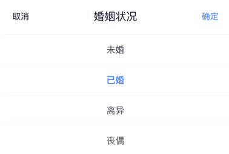
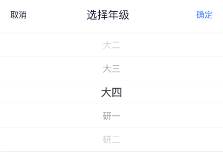
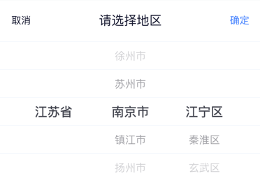
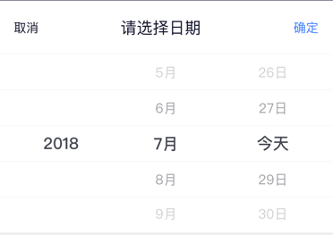

# tg-picker

## 代码示例

### 单选平铺



pickerData 属性支持静态数据传入，在组件的 ready 事件后

```html
<tg-selector
    :pickerData="pickerData"
    v-model="value"
    :title="title"
    :defaultIndex="defaultIndex"
    @pickerValue="pickerValue"
></tg-selector>
```

---

### 单选滚轮



pickerData 属性支持静态数据传入，在组件的 ready 事件后

```html
<tg-picker
    :pickerData="pickerData"
    v-model="value"
    :title="title"
    :cols="cols"
    :defaultIndex="defaultIndex"
    @pickerValue="pickerValue"
></tg-picker>
```

---

### 多级联动 - 地区选择



pickerData 属性支持静态数据传入，在组件的 ready 事件后

```html
<tg-picker
    :pickerData="pickerData"
    v-model="value"
    :title="title"
    :cols="cols"
    :defaultIndex="defaultIndex"
    @pickerValue="pickerValue"
></tg-picker>
```

---

### 多级联动 - 日期选择



pickerData 属性支持静态数据传入，在组件的 ready 事件后

```html
<tg-datePicker
    v-model="value"
    :title="title"
    :todayText="todayText"
    :type="type"
    :customTypes="customTypes"
    :formatType="formatType"
    @pickerValue="pickerValue"
></tg-datePicker>
```

---

### 多级联动 - 时间选择


pickerData 属性支持静态数据传入，在组件的 ready 事件后

```html
<tg-datePicker
    v-model="value"
    :title="title"
    :todayText="todayText"
    :type="type"
    :customTypes="customTypes"
    :formatType="formatType"
    @pickerValue="pickerValue"
></tg-datePicker>
```

---

### 级联Tab - 地区选择


pickerData 属性支持静态数据传入，在组件的 ready 事件后

```html
<tg-tabPicker
    v-model="value"
    :pickerData="pickerData"
    :title="title"
    @pickerValue="pickerValue"
></tg-tabPicker>
```

---

这里在标签上设置了 **@pickerValue事件** ，可以手动调用picker选择的数据进行外部填充的方法
```js
{
    methods:{
        pickerValue: function (val){
            this.value = val;
        }
  }
}
```

## API

### 属性

| 参数 | 说明 | 类型 | 可选值 | 默认值 | 备注 |
|------|-------|---------|-------|--------|--------|
| pickerData | 静态数据 | Array | [] |  |  |
| v-model | 显示隐藏 | Boolean | false或true | false |  |
| defaultIndex | 默认选中 | Array | [number] | [0] |  |
| cols | 显示列 | String | number | 1 |  |
| type | 日期选择类型	 | String | date, time, datetime, custom | date |    |
| custom-types | 自定义类型包含的日期元素 | Array |  [yyyy, MM, dd, hh, mm] |  | 仅用于type为custom |
| todayText | 今天展示文案设置 | String | 今天 | false | 使用&可占位日期数字，如&(今天) |

### Methods
| 方法名称 | 说明 | 参数 |
|---------- |-------- |---------- |
| pickerValue  | 选中项的值 | String  |

### Events
| 事件名称 | 说明 | 回调参数 |
|---------- |-------- |---------- |
| pickerValue  | 获取组件选中项的值 |   |   |
