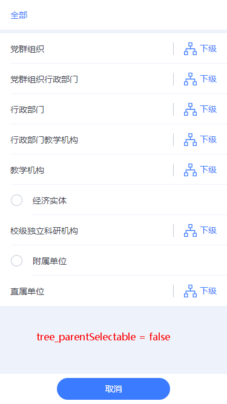

# 移动树组件（tg-tree）

该组件以组织机构数据格式为设计背景数据。树组件基本分类有：
    1.按照数据传入的方式分为`同步/异步`，
    2.按照选择的数据值多少可分为`单选/多选`，
    3.按照组件业务需求可分为`典型/自定义`

## 安装

### NPM
```js
npm install tg-tree --save

```

### CDN

```html
<!-- 引入组件库（js）文件 -->
<script src="https://res.wisedu.com/bower_components/vue2/vue.min.js"></script>
<script src="https://res.wisedu.com/fe_components/mobile/tg-tree/tg-tree.min.js"></script>
```

## 使用

### 基础用法


```html
<tg-tree 
    title="树示例" 
    v-model="value"
    :options="options">
</tg-tree>
```
```js
data() {
    return {
        value: '',
        options: [
            {"id": "1","name": "党群组织","pId": "","isParent": 1},
            {"id": "000010","name": "党群组织\/工会","pId": "1","isParent": 0},
            {"id": "000001","name": "党群组织\/党委办公室、统战部、机关党委","pId": "1","isParent": 0},
            {"id": "000011","name": "党群组织\/团委","pId": "1","isParent": 1},
            {"id": "000069","name": "党群组织\/团委\/办公室","pId": "000011","isParent": 1},
            {"id": "009969","name": "党群组织\/团委\/办公室\/科室","pId": "000069","isParent": 0},
            {"id": "8","name": "附属单位","pId": "","isParent": 0}
        ]
    }
}
```
> [options数据格式样例(http://res.wisedu.com/fe_components/mock/tree.js)](http://res.wisedu.com/fe_components/mock/tree.js)。
`options` 数据包含以下基本参数, `id` 为当前数据的唯一标识编号,`name` 为标识名称, `pId` 用于串连树结构各级数据,指向父级的 id (根数据 pId='' ),`isParent` 用来标识是否存在子级数据(1-存在/0-不存在);

### 标题(title)


```html
<tg-tree  v-model="value" :options="options"
    title="标题">
</tg-tree>
```
### 必填(required)


```html
<tg-tree title="树示例" v-model="value" :options="options"
    required>
</tg-tree>
```
### 禁用(disabled)


```html
<tg-tree title="树示例" v-model="value" :options="options" required
    disabled>
</tg-tree>
```
### 对齐方式(align)


```html
<!-- 对齐方式：左对齐（右对齐/居中） -->
<tg-tree v-model="value" :options="options" required
    align="left">
</tg-tree>
```
### 提示占位符(placeholder)


```html
<tg-tree v-model="value" :options="options"
    placeholder="提示占位符">
</tg-tree>
```
### 树父级可选(parentSelectable)



>默认 `parentSelectable` 为true

```html
<tg-tree v-model="value" :options="options"
    :parentSelectable="true">
</tg-tree>
```
## 进阶用法
### 同步单选树(isView = true)


> 该模式下，`options`值初始化为`[]`，展示面板点击时给`options`赋值。<br/><span style="color:red;">**注:**</span>  `value` 对面数据对象的`id`值，`keyName`对应数据对象的`name`值，这里的`keyName`仅用于初始化时`(options=[])`，数据面板的数据展示。如图所示：

```html
<tg-tree 
    title="单选树" 
    v-model="value"
    :keyName="keyName" 
    :options="options" 
    :parentSelectable="false" 
    :is-view="true"
    @cell-click="cellClick" 
    @selected-click="getSingleSelectedValue">
</tg-tree>
```
```js
import treeData from "../../mock/tree";
export default {
    data() {
        return {
            value: '',// '000423'
            options: [],
            keyName: '',// '行政部门\/人事处、人才工作领导小组办公室\/综合科'
        }
    },
    methods:{
        //展示面板点击事件，options赋值
        cellClick() {
            this.options = treeData.datas;
        },
        // 选中某项值后的方法
        getSingleSelectedValue(item) {
            // console.log(item);
        }
    }
}
```
### 同步单选树自定义展示面板(isView = false)


> 该模式下，展示面板 `tree-cell` 由开发者自定义，此时的 `v-model` 的值 `customSingleValue` 为布尔值(Boolean)，`customSingleValue = true` 时显示树组件，`customSingleValue = false` 时关闭树组件。`keyId` 为项中值对象中的 `id` 值，`keyName` 为项中值对象中的 `name` 值，这里 `keyId`、`keyName` 组件初始化时的数据展示回显。 

```html
<tree-cell title="自定义单选树面板" @click="customSingleTree" align="right" arrow style="margin-bottom:5px;" solid>
    <span>{{customSingleName}}</span>
</tree-cell>
<tg-tree 
    v-model="customSingleValue" 
    :keyId="customSingleId"
    :keyName="customSingleName"
    :options="customSingleOptions" 
    :parentSelectable="true" 
    :is-view="false" 
    @selected-click="getCustomSingleSelectedValue">
</tg-tree>
```
```js
import treeData from "../../mock/tree";
export default {
    data() {
        return {
            customSingleValue: false,
            customSingleId: '000423',//'',
            customSingleName: '行政部门\/人事处、人才工作领导小组办公室\/综合科',//'',
            customSingleOptions: [],
        }
    },
    methods:{
        // 调用树组件，为options赋值
        customSingleTree(){
            this.customSingleValue = true;
            this.customSingleOptions = treeData.datas;
        },
        // 选中某项值后的方法
        getCustomSingleSelectedValue(item){
            this.customSingleId = item.id;
            this.customSingleName = item.name;
        }
    }
}
```
### 异步单选树(isAsync = true)


> 异步加载数据，只需要将每次请求获取到的数据转换为组件需要的标准数据，赋值给`options`即可

```html
<tg-tree 
    title="异步单选树" 
    v-model="asyncSingleValue" 
    :keyName="asyncSingleName"
    :options="asyncSingleOptions" 
    :parentSelectable="true" 
    :is-view="true"
    :is-async="true" 
    @cell-click="cellClick"
    @selector-click="asyncSingleLoadOptions"
    @selected-click="getAsyncSingleSelectedValue">
</tg-tree>
```
```js
export default {
    data() {
        return {
            asyncSingleValue: '',//'1009',
            asyncSingleName: '',// '王二',
            asyncSingleOptions: [],
        }
    },
    methods:{
        //展示面板点击事件，初始化options值
        cellClick() {
            var that = this;
            utils.Post('http://localhost:8080/emap/sys/emapflow/usergroup/getUsers.do',{}).then(function(res){
                // 示例1: 如果返回值res.datas的值刚好满足s数据格式,形如： [{"id": "1","name": "党群组织","pId": "","isParent": 1}],可直接赋值
                that.asyncSingleOptions = res.datas;

                // 示例2: 如果返回的res.datas的值非标准模式，如下所示，则需要对数据进行转换
                // res.datas = [{id: "TD_LSDEPT", name: "临时人员", type: "group"},
                //            {id: "4", name: "酱油部2", type: "group"},
                //            {id: "1", name: "云工厂", type: "group"},
                //            {id: "3", name: "行政部", type: "group"},
                //            {id: "1009", name: "王二", type: "user"}]
                // that.asyncSingleOptions = that.dataTranslation(res.datas);
            },function(err){
                console.log(err)
            });
        },
        // 异步加载数据
        asyncSingleLoadOptions(id){
            var that = this;
            utils.Post('http://localhost:8080/emap/sys/emapflow/usergroup/getUsers.do',{'searchKey':id}).then(function(res){
                // 示例1: 如果返回值res.datas的值刚好满足s数据格式,形如： [{"id": "1","name": "党群组织","pId": "","isParent": 1}],可直接赋值
                that.asyncSingleOptions = res.datas;

                // 示例2: 如果返回的res.datas的值非标准模式，如下所示，则需要对数据进行转换
                // res.datas = [{id: "01548998", superId: "TD_LSDEPT", name: "导入姓名2", type: "group"},
                //            {id: "01548997", superId: "TD_LSDEPT", name: "导入姓名3", type: "user"},
                //            {id: "user1", superId: "TD_LSDEPT", name: "导入姓名4", type: "user"},
                //            {id: "01548995", superId: "TD_LSDEPT", name: "导入姓名5", type: "user"},
                //            {id: "01548999", superId: "TD_LSDEPT", name: "导入姓名1", type: "user"}]
                // that.asyncSingleOptions = that.dataTranslation(res.datas);
            },function(err){
                console.log(err)
            });
        },
        // 获取选中值
        getAsyncSingleSelectedValue(item){
            console.log(item)
        },
        // 数据格式转换
        dataTranslation(arr) {
            var result = [];
            result = arr.map(function(obj){
                if(obj.type === "group"){
                    obj.isParent = 1;
                }else{
                    obj.isParent = 0;
                }
                obj.pId = obj.superId?obj.superId:'';
                return obj
            });
            return result;
        }
    }
}
```

### 异步单选树自定义展示面板(isAsync = true)


> 该模式与[异步单选树](#异步单选树isasync--true) 唯一区别在与数据显示/展示面板(即示例中的`tree-cell`)完全可根据开发者的需求自定义。其中`keyId`、`keyName`用于初始化数据回显，效果同上

```html
<tree-cell title="自定义异步单选树面板" @click="customAsyncSingleTree" align="right" arrow style="margin-bottom:5px;" solid>
    <span>{{customAsyncSingleName}}</span>
</tree-cell>
<tg-tree 
    v-model="customAsyncSingleValue" 
    :keyId="customAsyncSingleId"
    :keyName="customAsyncSingleName"
    :options="customAsyncSingleOptions" 
    :parentSelectable="true" 
    :is-view="false"
    :is-async="true" 
    @selector-click="customAsyncSingleLoadOptions"
    @selected-click="getCustomAsyncSingleSelectedValue">
</tg-tree>
```
```js
export default {
    data() {
        return {
            customAsyncSingleValue: false,
            customAsyncSingleId: '',// '1009',
            customAsyncSingleName: '', // '王二',
            customAsyncSingleOptions: [],
        }
    },
    methods:{
        //展示面板点击事件，初始化options值
        customAsyncSingleTree() {
            var that = this;
            utils.Post('http://localhost:8080/emap/sys/emapflow/usergroup/getUsers.do',{}).then(function(res){
                // 示例1: 如果返回值res.datas的值刚好满足s数据格式,形如： [{"id": "1","name": "党群组织","pId": "","isParent": 1}],可直接赋值
                that.customAsyncSingleOptions = res.datas;

                // 示例2: 如果返回的res.datas的值非标准模式，如下所示，则需要对数据进行转换
                // res.datas = [{id: "TD_LSDEPT", name: "临时人员", type: "group"},
                //            {id: "4", name: "酱油部2", type: "group"},
                //            {id: "1", name: "云工厂", type: "group"},
                //            {id: "3", name: "行政部", type: "group"},
                //            {id: "1009", name: "王二", type: "user"}]
                // that.customAsyncSingleOptions = that.dataTranslation(res.datas);
            },function(err){
                console.log(err)
            });
        },
        // 异步加载数据
        customAsyncSingleLoadOptions(id){
            var that = this;
            utils.Post('http://localhost:8080/emap/sys/emapflow/usergroup/getUsers.do',{'searchKey':id}).then(function(res){
                // 示例1: 如果返回值res.datas的值刚好满足s数据格式,形如： [{"id": "1","name": "党群组织","pId": "","isParent": 1}],可直接赋值
                that.asyncSingleOptions = res.datas;

                // 示例2: 如果返回的res.datas的值非标准模式，如下所示，则需要对数据进行转换
                // res.datas = [{id: "01548998", superId: "TD_LSDEPT", name: "导入姓名2", type: "group"},
                //            {id: "01548997", superId: "TD_LSDEPT", name: "导入姓名3", type: "user"},
                //            {id: "user1", superId: "TD_LSDEPT", name: "导入姓名4", type: "user"},
                //            {id: "01548995", superId: "TD_LSDEPT", name: "导入姓名5", type: "user"},
                //            {id: "01548999", superId: "TD_LSDEPT", name: "导入姓名1", type: "user"}]
                // that.customAsyncSingleOptions = that.dataTranslation(res.datas);
            },function(err){
                console.log(err)
            });
        },
        // 获取选中值
        getCustomAsyncSingleSelectedValue(item){
            this.customAsyncSingleId = item.id;
            this.customAsyncSingleName = item.name;
        },
        // 数据格式转换
        dataTranslation(arr) {
            var result = [];
            result = arr.map(function(obj){
                if(obj.type === "group"){
                    obj.isParent = 1;
                }else{
                    obj.isParent = 0;
                }
                obj.pId = obj.superId?obj.superId:'';
                return obj
            });
            return result;
        }
    }
}
```
### 同步多选树(multiple = true)


 

```html
<tg-tree 
    title="多选树" 
    v-model="multiValue"
    :keyName="multiKeyName" 
    :options="multiOptions" 
    :parentSelectable="false" 
    :is-view="true" 
    multiple
    @cell-click="cellClick">
</tg-tree>
```
```js
import treeData from "../../mock/tree";
export default {
    data() {
        return {
            multiValue: [],//["6", "8", "000153"],
            multiKeyName: '',//'经济实体,附属单位,直属单位\/江浦实验农场\/生产科',
            multiOptions: [],
        }
    },
    methods: {
        cellClick() {
            this.multiOptions = treeData.datas;
        }
    }
}
```
### 同步多选树自定义展示面板(multiple = true,isView = false)
 
> 该模式下，展示面板 `tree-cell` 由开发者自定义，此时的 `v-model` 的值 `customMultiValue` 为布尔值(Boolean)，`customMultiValue = true` 时显示树组件，`customMultiValue = false` 时关闭树组件。`keyId` 为项中值对象中的 `id` 值，`keyName` 为项中值对象中的 `name` 值，这里 `keyId`、`keyName` 组件初始化时的数据展示回显。 <br/> 
效果图请参看[同步多选树](#同步多选树multiple--true)

```html
<tree-cell title="自定义多选树面板" @click="customMultiTree" align="right" arrow style="margin-bottom:5px;" solid>
    <span>{{customMultiName}}</span>
</tree-cell>
<tg-tree 
    v-model="customMultiValue"
    :keyId="customMultiIds"
    :keyName="customMultiName" 
    :options="customMultiOptions"
    :parentSelectable="false"
    :is-view="false"
    multiple
    @selected-click="getCustomMultiSelectedValue">
</tg-tree>
```
```js
import treeData from "../../mock/tree";
export default {
    data() {
        return {
            customMultiValue: false,
            customMultiIds: ["6", "8", "000153"], // [],
            customMultiName: '经济实体,附属单位,直属单位\/江浦实验农场\/生产科',//'',
            customMultiOptions: [],//treeData.datas,
        }
    },
    methods: {
        // 展示面板点击事件，初始化options值
        customMultiTree() {
            this.customMultiValue = true;
            this.customMultiOptions = treeData.datas;
        },
        // 获取选中值
        getCustomMultiSelectedValue(ids,labels,opts) {
            // ids为选中值的id数组，labels为选中值的name拼接出的字符串，opts为选中值的数组对象
            this.customMultiIds = ids;
            this.customMultiName = labels;
        }
    }
}
```
### 异步多选树(multiple = true, isAsync = true, isView = true)


```html
<tg-tree 
    title="异步多选树" 
    v-model="asyncMultiValue"
    :keyName="asyncMultiKeyName" 
    :options="asyncMultiOptions" 
    :parentSelectable="true" 
    :is-view="true"
    :is-async="true" 
    multiple
    @cell-click="cellClick"
    @selector-click="asyncMultiLoadOptions">
</tg-tree>
```
```js
export default {
    data() {
        return {
            asyncMultiValue: ["1009","user1","1002"],
            asyncMultiKeyName: '王二,导入姓名4,虚拟人2',
            asyncMultiOptions: [],
        }
    },
    methods:{
        //展示面板点击事件，初始化options值
        cellClick() {
            var that = this;
            utils.Post('http://localhost:8080/emap/sys/emapflow/usergroup/getUsers.do',{}).then(function(res){
                // 示例1: 如果返回值res.datas的值刚好满足s数据格式,形如： [{"id": "1","name": "党群组织","pId": "","isParent": 1}],可直接赋值
                that.customAsyncSingleOptions = res.datas;

                // 示例2: 如果返回的res.datas的值非标准模式，如下所示，则需要对数据进行转换
                // res.datas = [{id: "TD_LSDEPT", name: "临时人员", type: "group"},
                //            {id: "4", name: "酱油部2", type: "group"},
                //            {id: "1", name: "云工厂", type: "group"},
                //            {id: "3", name: "行政部", type: "group"},
                //            {id: "1009", name: "王二", type: "user"}]
                // that.asyncMultiOptions = that.dataTranslation(res.datas);
            },function(err){
                console.log(err)
            });
        },
        // 异步加载数据
        asyncMultiLoadOptions(id){
            var that = this;
            utils.Post('http://localhost:8080/emap/sys/emapflow/usergroup/getUsers.do',{'searchKey':id}).then(function(res){
                // 示例1: 如果返回值res.datas的值刚好满足s数据格式,形如： [{"id": "1","name": "党群组织","pId": "","isParent": 1}],可直接赋值
                that.asyncMultiOptions = res.datas;

                // 示例2: 如果返回的res.datas的值非标准模式，如下所示，则需要对数据进行转换
                // res.datas = [{id: "01548998", superId: "TD_LSDEPT", name: "导入姓名2", type: "group"},
                //            {id: "01548997", superId: "TD_LSDEPT", name: "导入姓名3", type: "user"},
                //            {id: "user1", superId: "TD_LSDEPT", name: "导入姓名4", type: "user"},
                //            {id: "01548995", superId: "TD_LSDEPT", name: "导入姓名5", type: "user"},
                //            {id: "01548999", superId: "TD_LSDEPT", name: "导入姓名1", type: "user"}]
                // that.asyncMultiOptions = that.dataTranslation(res.datas);
            },function(err){
                console.log(err)
            });
        },
        // 数据格式转换
        dataTranslation(arr) {
            var result = [];
            result = arr.map(function(obj){
                if(obj.type === "group"){
                    obj.isParent = 1;
                }else{
                    obj.isParent = 0;
                }
                obj.pId = obj.superId?obj.superId:'';
                return obj
            });
            return result;
        }
    }
}
```

### 异步多选树自定义展示面板(multiple = true, isAsync = true, isView = false)


> 该模式下，展示面板 `tree-cell` 由开发者自定义，此时的 `v-model` 的值 `customAsyncMultiValue` 为布尔值(Boolean)，`customAsyncMultiValue = true` 时显示树组件，`customAsyncMultiValue = false` 时关闭树组件。`keyId` 为项中值对象中的 `id` 值，`keyName` 为项中值对象中的 `name` 值，这里 `keyId`、`keyName` 组件初始化时的数据展示回显。 <br/> 
效果图请参看[异步多选树](#异步多选树multiple--true-isasync--true-isview--true)

```html
<tree-cell title="自定义异步多选树面板" @click="customAsyncMultiTree" align="right" arrow style="margin-bottom:5px;" solid>
    <span>{{customAsyncMultiName}}</span>
</tree-cell>
<tg-tree 
    v-model="customAsyncMultiValue"
    :keyId="customAsyncMultiIds"
    :keyName="customAsyncMultiName" 
    :options="customAsyncMultiOptions" 
    :parentSelectable="true" 
    :is-view="false"
    :is-async="true"
    multiple
    @selector-click="customAsyncMultiLoadOptions"
    @selected-click="getCustomAsyncMultiSelectedValue">
</tg-tree>
```
```js
export default {
    data() {
        return {
            customAsyncMultiValue: false,
            customAsyncMultiIds: ["1009","user1","1002"],
            customAsyncMultiName: '王二,导入姓名4,虚拟人2',
            customAsyncMultiOptions: [],
        }
    },
    methods:{
        //展示面板点击事件，初始化options值
        customAsyncMultiTree() {
            var that = this;
            utils.Post('http://localhost:8080/emap/sys/emapflow/usergroup/getUsers.do',{}).then(function(res){
                // 示例1: 如果返回值res.datas的值刚好满足s数据格式,形如： [{"id": "1","name": "党群组织","pId": "","isParent": 1}],可直接赋值
                that.customAsyncMultiOptions = res.datas;

                // 示例2: 如果返回的res.datas的值非标准模式，如下所示，则需要对数据进行转换
                // res.datas = [{id: "TD_LSDEPT", name: "临时人员", type: "group"},
                //            {id: "4", name: "酱油部2", type: "group"},
                //            {id: "1", name: "云工厂", type: "group"},
                //            {id: "3", name: "行政部", type: "group"},
                //            {id: "1009", name: "王二", type: "user"}]
                // that.customAsyncMultiOptions = that.dataTranslation(res.datas);
            },function(err){
                console.log(err)
            });
        },
        // 异步加载数据
        customAsyncMultiLoadOptions(id){
            var that = this;
            utils.Post('http://localhost:8080/emap/sys/emapflow/usergroup/getUsers.do',{'searchKey':id}).then(function(res){
                // 示例1: 如果返回值res.datas的值刚好满足s数据格式,形如： [{"id": "1","name": "党群组织","pId": "","isParent": 1}],可直接赋值
                that.customAsyncMultiOptions = res.datas;

                // 示例2: 如果返回的res.datas的值非标准模式，如下所示，则需要对数据进行转换
                // res.datas = [{id: "01548998", superId: "TD_LSDEPT", name: "导入姓名2", type: "group"},
                //            {id: "01548997", superId: "TD_LSDEPT", name: "导入姓名3", type: "user"},
                //            {id: "user1", superId: "TD_LSDEPT", name: "导入姓名4", type: "user"},
                //            {id: "01548995", superId: "TD_LSDEPT", name: "导入姓名5", type: "user"},
                //            {id: "01548999", superId: "TD_LSDEPT", name: "导入姓名1", type: "user"}]
                // that.customAsyncMultiOptions = that.dataTranslation(res.datas);
            },function(err){
                console.log(err)
            });
        },
        // 获取选中值
        getCustomAsyncMultiSelectedValue(ids,labels,opts){
            this.customAsyncMultiIds = ids;
            this.customAsyncMultiName = labels;
        },
        // 数据格式转换
        dataTranslation(arr) {
            var result = [];
            result = arr.map(function(obj){
                if(obj.type === "group"){
                    obj.isParent = 1;
                }else{
                    obj.isParent = 0;
                }
                obj.pId = obj.superId?obj.superId:'';
                return obj
            });
            return result;
        }
    }
}
```

##API

### 属性(Attributes)

| 参数 | 功能说明 | 类型 | 可选值 | 默认值 | 备注 |
|------|-------|---------|-------|--------|--------|
| value | 当前值/状态值 | String/Array/Boolean | - | - | 单选树-String，多选树-Array，状态(isView = false)-Boolean |
| keyId | id回显值 | String,Number,Array | - | - | `isView = false`有效，用于数据回显 |
| keyName | name回显值 | String | - | - |  |
| options | 树组件源数据 | Array | - | - | - |
| title | 标题 | String | - | - | `isView=true` 有效 |
| required | 必填 | Boolean | true/false | `false` | `isView = true` 有效 |
| disabled | 禁用 | Boolean | true/false | `false` | `isView = true` 有效 |
| align | 对齐方式 | String | left/center/right | `right` | `isView = true` 有效 |
| placeholder | 提示占位符 | String | - | `请选择` | `isView=true` 有效 |
| hasSearch | 是否有搜索框 | Boolean | - | `false` | 开发中 |
| searchPlaceholder | 搜索框提示占位符 | String | - | `搜索` | 开发中 |
| isAsync | 是否为异步 | Boolean | - | `false` | 默认同步 |
| parentSelectable | 是否父级可选 | Boolean | - | `true` | 默认父级可选 |
| isView | 是否自定义显示面板 | Boolean | - | `false` | 默认非自定义 |
| multiple | 是否多选 | Boolean | - | `false` | 默认单选 |
| divider | 多选分隔符 | String | [',','-','/','%','&','--'] | `,` | `multiple = true`有效 |

### option属性 子属性说明
选择项数组格式如下:<br/>
其中id为唯一标识值，name为展示名称，pId为父级的id值，isParent用来标识是否存在子级数据（isParent-1：存在，isParent-0：不存在）

```js
[
  {"id": "1","name": "名称","pId": "","isParent": 1}
]
```


### 事件(Events)
| 事件名称 | 说明 | 回调参数1 | 回调参数2 | 回调参数3 |
|---------- |-------- |---------- |
| cell-click | `isView = true`有效,点击展示面板触发 | - | - | - |
| selector-click | 树组件展示项点击时触发，用于异步加载数据 | 当前点击项的id | - | - |
| selected-click | 树组件结束选择时触发 | 单选时返回选中项对象item；多选时返回所有选中项数组ids | 多选时有效-返回所有选中项拼接字符串names | 多选时有效-返回所有选中项数组对象 items | 

